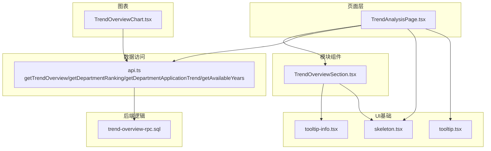
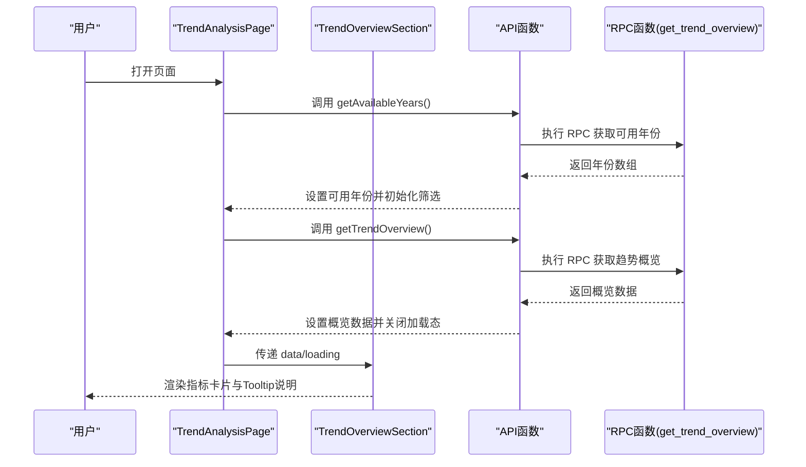
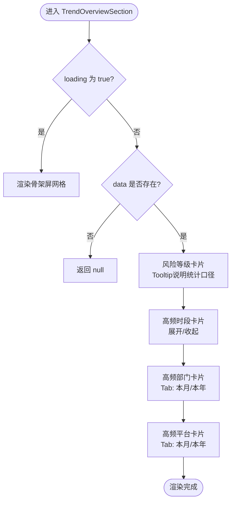
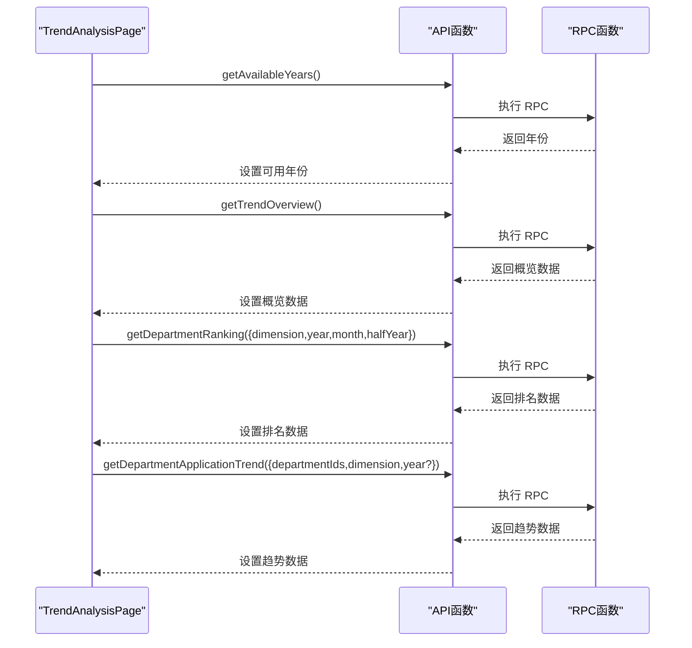
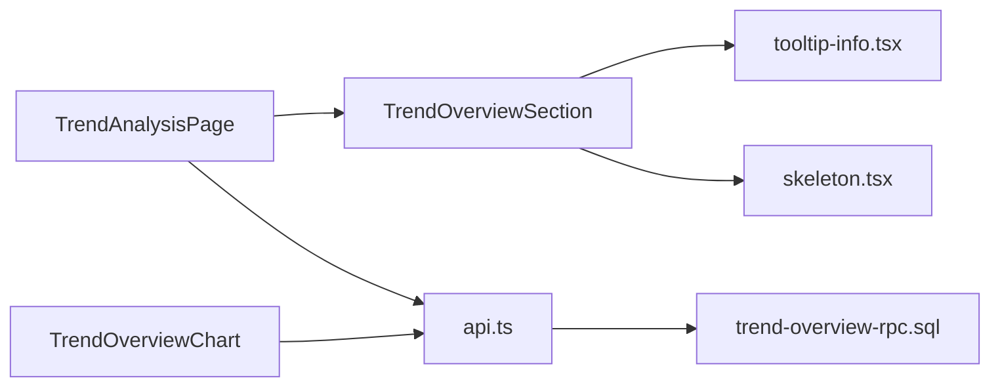

# 页面优化与用户体验

<cite>
**本文引用的文件**
- [TrendAnalysisPage.tsx](file://src/pages/TrendAnalysisPage.tsx)
- [TrendOverviewSection.tsx](file://src/components/trend/TrendOverviewSection.tsx)
- [skeleton.tsx](file://src/components/ui/skeleton.tsx)
- [tooltip.tsx](file://src/components/ui/tooltip.tsx)
- [tooltip-info.tsx](file://src/components/ui/tooltip-info.tsx)
- [use-debounce.ts](file://src/hooks/use-debounce.ts)
- [api.ts](file://src/db/api.ts)
- [TrendOverviewChart.tsx](file://src/components/charts/TrendOverviewChart.tsx)
- [trend-overview-rpc.sql](file://trend-overview-rpc.sql)
</cite>

## 目录
1. [引言](#引言)
2. [项目结构](#项目结构)
3. [核心组件](#核心组件)
4. [架构总览](#架构总览)
5. [详细组件分析](#详细组件分析)
6. [依赖关系分析](#依赖关系分析)
7. [性能考量](#性能考量)
8. [故障排查指南](#故障排查指南)
9. [结论](#结论)
10. [附录](#附录)

## 引言
本文件围绕趋势分析页面的架构改进与用户体验优化进行系统化梳理，重点聚焦 TrendAnalysisPage 的整体布局与数据流、TrendOverviewSection 的指标卡片与交互设计、加载状态的骨架屏与空数据提示、与用户交互相关的 Tooltip 说明与悬停细节，以及重构带来的技术价值（代码量减少、维护成本降低、性能提升）。文档通过可视化图示与分层讲解，帮助读者快速理解并高效迭代该页面。

## 项目结构
趋势分析页面由页面容器与多个子组件构成，采用“页面容器 + 模块化组件”的分层组织方式。页面容器负责状态管理与数据加载，模块组件负责各自领域的展示与交互；UI 基础组件提供骨架屏、提示框等通用能力；数据库访问通过 API 函数封装 RPC 查询；图表组件负责趋势可视化。

**图表来源**
- [TrendAnalysisPage.tsx](file://src/pages/TrendAnalysisPage.tsx#L1-L678)
- [TrendOverviewSection.tsx](file://src/components/trend/TrendOverviewSection.tsx#L1-L330)
- [skeleton.tsx](file://src/components/ui/skeleton.tsx#L1-L14)
- [tooltip.tsx](file://src/components/ui/tooltip.tsx#L1-L62)
- [tooltip-info.tsx](file://src/components/ui/tooltip-info.tsx#L1-L44)
- [api.ts](file://src/db/api.ts#L2043-L2148)
- [TrendOverviewChart.tsx](file://src/components/charts/TrendOverviewChart.tsx#L1-L158)
- [trend-overview-rpc.sql](file://trend-overview-rpc.sql#L1-L132)

**章节来源**
- [TrendAnalysisPage.tsx](file://src/pages/TrendAnalysisPage.tsx#L1-L678)
- [TrendOverviewSection.tsx](file://src/components/trend/TrendOverviewSection.tsx#L1-L330)

## 核心组件
- TrendAnalysisPage：页面容器，负责加载可用年份、部门列表、趋势概览、排名与趋势数据，管理筛选参数与加载状态，渲染三大模块（趋势概览、通报排名、趋势分析）。
- TrendOverviewSection：趋势总览模块，展示风险等级、高频时段、高频部门、高频平台四类指标卡片，提供展开/收起与 Tooltip 说明。
- UI 基础组件：Skeleton 提供骨架屏占位，Tooltip/TooltipInfo 提供悬浮提示与统计口径说明。
- 数据访问：API 函数封装 RPC 查询，包括趋势概览、部门排名、部门应用趋势、可用年份。
- 图表：TrendOverviewChart 负责趋势折线图渲染。

**章节来源**
- [TrendAnalysisPage.tsx](file://src/pages/TrendAnalysisPage.tsx#L1-L678)
- [TrendOverviewSection.tsx](file://src/components/trend/TrendOverviewSection.tsx#L1-L330)
- [skeleton.tsx](file://src/components/ui/skeleton.tsx#L1-L14)
- [tooltip.tsx](file://src/components/ui/tooltip.tsx#L1-L62)
- [tooltip-info.tsx](file://src/components/ui/tooltip-info.tsx#L1-L44)
- [api.ts](file://src/db/api.ts#L2043-L2148)
- [TrendOverviewChart.tsx](file://src/components/charts/TrendOverviewChart.tsx#L1-L158)

## 架构总览
页面采用“容器组件 + 模块组件 + UI 基础 + 数据访问 + 图表”的分层架构。容器组件集中管理状态与副作用，模块组件专注单一职责，UI 基础组件提供通用交互能力，数据访问通过 API 函数抽象 RPC，图表组件负责可视化渲染。

**图表来源**
- [TrendAnalysisPage.tsx](file://src/pages/TrendAnalysisPage.tsx#L1-L678)
- [TrendOverviewSection.tsx](file://src/components/trend/TrendOverviewSection.tsx#L1-L330)
- [api.ts](file://src/db/api.ts#L2712-L2756)
- [trend-overview-rpc.sql](file://trend-overview-rpc.sql#L1-L132)

## 详细组件分析

### TrendOverviewSection 组件：布局设计与指标卡片
- 布局设计
  - 采用响应式网格：1列（移动端）、2列（平板及以上）、4列（大屏），通过 Tailwind 断点类实现自适应。
  - 指标卡片采用卡片容器，配合渐变背景与边框强调层级，突出关键信息。
- 指标卡片
  - 本月通报风险等级：根据统计口径动态计算风险等级，展示等级标签与当月通报次数。
  - 本年通报高频时段：按阈值筛选并排序，支持展开/收起查看更多。
  - 高频通报部门：Tab 切换“本月前三”与“本年前三”，展示部门名称与次数。
  - 高频被通报平台：Tab 切换“本月前三”与“本年前三”，展示平台名称与次数。
- 交互与提示
  - 每个指标卡片右侧配有 TooltipInfo，用于说明统计口径与规则。
  - 展开/收起按钮使用图标与文案结合，提升可发现性。
- 空数据与加载态
  - 加载态：骨架屏网格占位，保证首屏流畅。
  - 空数据：各卡片内提供“暂无数据”提示，避免空白区域。

**图表来源**
- [TrendOverviewSection.tsx](file://src/components/trend/TrendOverviewSection.tsx#L1-L330)
- [tooltip-info.tsx](file://src/components/ui/tooltip-info.tsx#L1-L44)
- [skeleton.tsx](file://src/components/ui/skeleton.tsx#L1-L14)

**章节来源**
- [TrendOverviewSection.tsx](file://src/components/trend/TrendOverviewSection.tsx#L1-L330)

### TrendAnalysisPage：页面容器与数据流
- 状态管理
  - 趋势概览：data/loading 控制 TrendOverviewSection 的渲染与加载态。
  - 通报排名：维度选择（月度/半年度/年度/全部）、年份、月份、半年度，控制 getDepartmentRanking 的请求参数。
  - 趋势分析：部门选择、数据维度（按年/全部）、年份，控制 getDepartmentApplicationTrend 的请求参数。
- 数据加载与副作用
  - 首次挂载：加载可用年份、部门列表、趋势概览。
  - 排名参数变化：触发 getDepartmentRanking 请求。
  - 趋势参数变化：触发 getDepartmentApplicationTrend 请求。
- 视觉与交互
  - 排行榜：支持展开/收起，仅展示前若干条，其余折叠。
  - 趋势图表：折线图与数据表格并排（宽屏）或垂直堆叠（窄屏），支持 Tooltip 悬停显示详细数值。
  - 空数据提示：在未选择部门或无数据时给出明确提示。
- 加载态
  - 页面初次加载：骨架屏卡片占位。
  - 排行榜加载：骨架屏列表占位。
  - 趋势图表加载：骨架屏占位。

**图表来源**
- [TrendAnalysisPage.tsx](file://src/pages/TrendAnalysisPage.tsx#L1-L678)
- [api.ts](file://src/db/api.ts#L2043-L2148)
- [trend-overview-rpc.sql](file://trend-overview-rpc.sql#L1-L132)

**章节来源**
- [TrendAnalysisPage.tsx](file://src/pages/TrendAnalysisPage.tsx#L1-L678)

### 加载状态与空数据提示
- 骨架屏
  - 页面初次加载：卡片标题与内容区域使用骨架屏占位，提升感知速度。
  - 排行榜加载：列表项使用骨架屏占位，避免闪烁。
  - 趋势图表加载：图表区域使用骨架屏占位。
- 空数据提示
  - 未选择部门：提示“请选择部门以查看趋势分析”。
  - 选择时间范围内无数据：提示“所选时间范围内暂无数据”。

**章节来源**
- [TrendAnalysisPage.tsx](file://src/pages/TrendAnalysisPage.tsx#L1-L678)
- [skeleton.tsx](file://src/components/ui/skeleton.tsx#L1-L14)

### 用户交互：Tooltip 说明统计口径与悬停细节
- 统计口径说明
  - TrendOverviewSection 中的四个指标卡片均配有 TooltipInfo，用于解释统计口径与规则，确保用户理解数据含义。
- 悬停显示详细数据
  - TrendOverviewChart 使用 ECharts 的 Tooltip，悬停时显示月份与应用数量等详细信息。
  - TrendAnalysisPage 的折线图使用 Recharts 的 Tooltip，悬停时显示日期与应用数量。

**章节来源**
- [TrendOverviewSection.tsx](file://src/components/trend/TrendOverviewSection.tsx#L1-L330)
- [tooltip-info.tsx](file://src/components/ui/tooltip-info.tsx#L1-L44)
- [TrendOverviewChart.tsx](file://src/components/charts/TrendOverviewChart.tsx#L1-L158)
- [TrendAnalysisPage.tsx](file://src/pages/TrendAnalysisPage.tsx#L1-L678)

### 自动刷新机制
- 页面未内置定时器或轮询逻辑，数据更新遵循用户交互驱动的请求模式：
  - 首次进入页面时加载必要数据；
  - 用户切换筛选参数时触发对应 API 请求；
  - 未见显式的 setInterval/setTimeout 自动刷新实现。
- 若需引入自动刷新，建议：
  - 在容器组件中使用 useEffect + setTimeout 或 useDebounce 控制刷新频率；
  - 对关键指标（如趋势概览）设置较短刷新周期，其他模块设置较长周期；
  - 使用防抖钩子避免频繁切换导致的抖动。

**章节来源**
- [TrendAnalysisPage.tsx](file://src/pages/TrendAnalysisPage.tsx#L1-L678)
- [use-debounce.ts](file://src/hooks/use-debounce.ts#L1-L16)

## 依赖关系分析
- 组件耦合
  - TrendAnalysisPage 作为容器，耦合 API 函数与多个模块组件，职责清晰。
  - TrendOverviewSection 依赖 TooltipInfo 与 Skeleton，模块内聚度高。
- 外部依赖
  - 数据访问通过 API 函数封装 RPC，隔离数据库实现细节。
  - 图表组件分别使用 ECharts 与 Recharts，职责分离。
- 循环依赖
  - 未发现循环依赖迹象，组件间为单向依赖。

**图表来源**
- [TrendAnalysisPage.tsx](file://src/pages/TrendAnalysisPage.tsx#L1-L678)
- [TrendOverviewSection.tsx](file://src/components/trend/TrendOverviewSection.tsx#L1-L330)
- [api.ts](file://src/db/api.ts#L2043-L2148)
- [TrendOverviewChart.tsx](file://src/components/charts/TrendOverviewChart.tsx#L1-L158)
- [trend-overview-rpc.sql](file://trend-overview-rpc.sql#L1-L132)

**章节来源**
- [TrendAnalysisPage.tsx](file://src/pages/TrendAnalysisPage.tsx#L1-L678)
- [TrendOverviewSection.tsx](file://src/components/trend/TrendOverviewSection.tsx#L1-L330)

## 性能考量
- 首屏加载
  - 使用骨架屏占位，显著改善感知性能，减少白屏时间。
- 数据请求
  - 通过 API 函数封装 RPC，避免在页面层直接操作数据库，降低耦合与出错概率。
- 图表渲染
  - TrendOverviewChart 关闭动画，减少不必要的重绘与过渡开销。
- 响应式布局
  - 采用 Tailwind 断点类，避免复杂媒体查询，提升渲染效率。
- 可选优化建议
  - 对高频指标使用缓存策略，减少重复请求。
  - 对趋势图表启用懒加载，在可视区域外暂停渲染。
  - 对排行榜数据分页或虚拟滚动，避免一次性渲染大量节点。

[本节为通用性能讨论，无需特定文件引用]

## 故障排查指南
- 数据不显示
  - 检查网络连接与浏览器控制台错误。
  - 确认筛选参数（时间维度、年份、部门）是否合理。
  - 确认所选时间段是否存在数据。
- 加载缓慢
  - 检查网络速度与服务器响应。
  - 尝试缩小时间范围或切换到更少的数据维度。
  - 清理浏览器缓存后重试。
- 排名不正确
  - 确认查看的是“通报频次”还是“通报应用量”排行榜。
  - 确认时间维度与年份选择是否符合预期。

**章节来源**
- [TrendAnalysisPage.tsx](file://src/pages/TrendAnalysisPage.tsx#L1-L678)

## 结论
通过模块化组件与清晰的状态管理，趋势分析页面实现了良好的可维护性与可扩展性。TrendOverviewSection 的指标卡片与 Tooltip 说明提升了数据可读性，骨架屏与空数据提示优化了用户体验。若需进一步增强，可在容器层引入自动刷新与防抖策略，同时持续优化图表渲染与数据缓存，以获得更佳的性能表现。

[本节为总结性内容，无需特定文件引用]

## 附录

### 响应式网格与布局要点
- TrendOverviewSection：1列（移动端）、2列（平板）、4列（大屏）。
- 趋势分析模块：宽屏双列（图表+表格并排），窄屏单列（垂直堆叠）。
- 间距与留白：使用响应式 gap 类，保证移动端紧凑、桌面端舒展。

**章节来源**
- [TrendOverviewSection.tsx](file://src/components/trend/TrendOverviewSection.tsx#L1-L330)
- [TrendAnalysisPage.tsx](file://src/pages/TrendAnalysisPage.tsx#L1-L678)

### 统计口径与交互说明
- TrendOverviewSection 中的风险等级、高频时段、高频部门、高频平台均配有 TooltipInfo，解释统计口径与规则。
- TrendOverviewChart 与 TrendAnalysisPage 的折线图均支持悬停显示详细数据。

**章节来源**
- [TrendOverviewSection.tsx](file://src/components/trend/TrendOverviewSection.tsx#L1-L330)
- [TrendOverviewChart.tsx](file://src/components/charts/TrendOverviewChart.tsx#L1-L158)
- [TrendAnalysisPage.tsx](file://src/pages/TrendAnalysisPage.tsx#L1-L678)