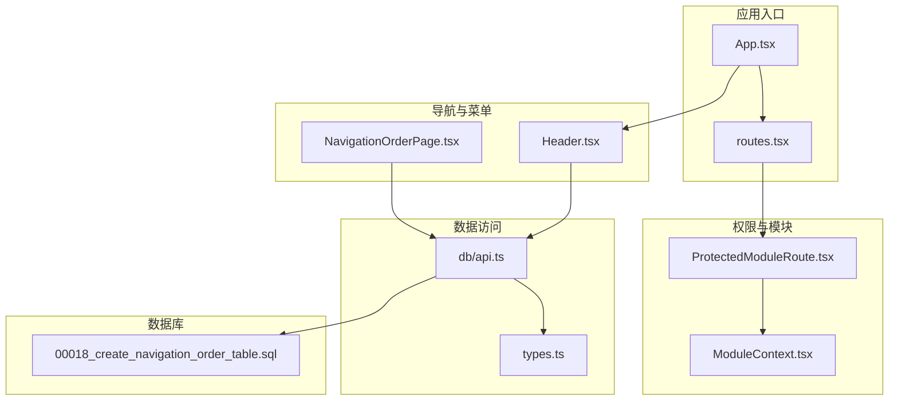
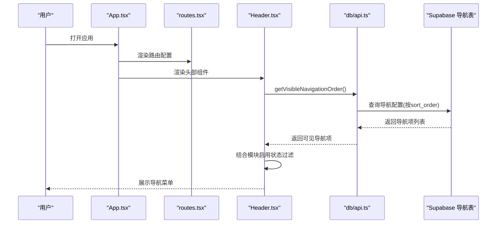
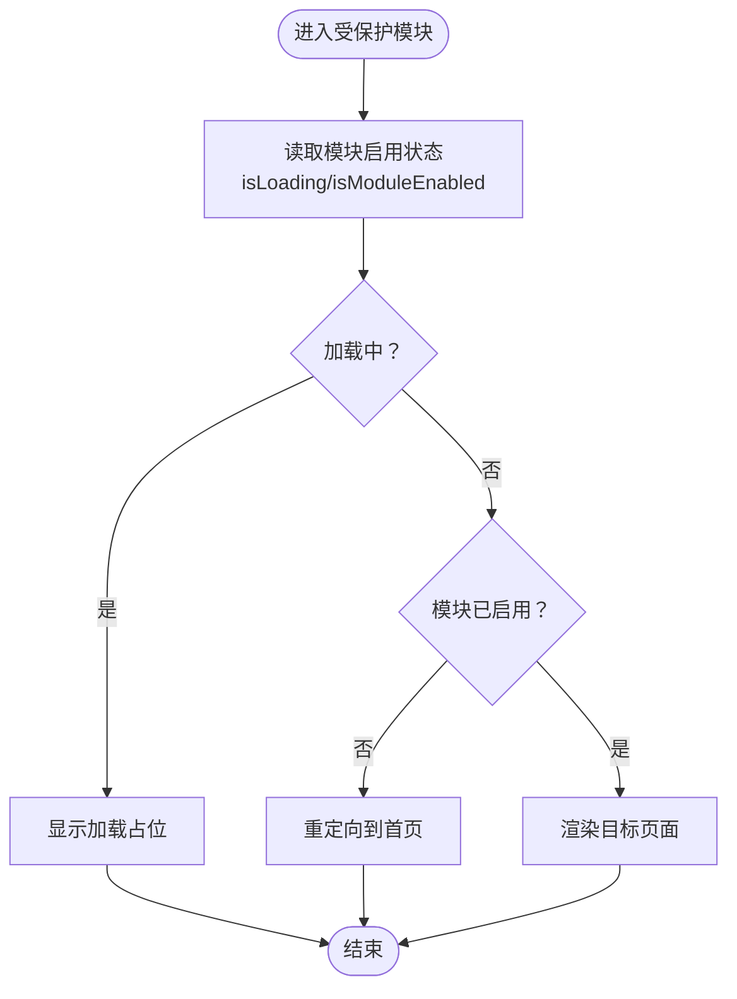
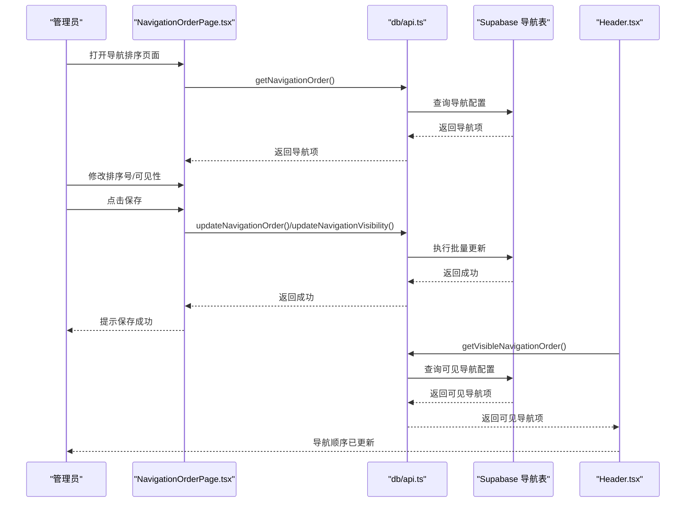
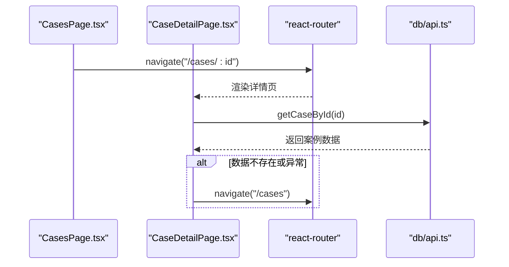
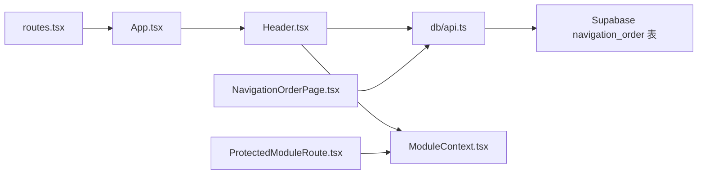

# 路由与导航

<cite>
**本文引用的文件**
- [App.tsx](file://src/App.tsx)
- [routes.tsx](file://src/routes.tsx)
- [ProtectedModuleRoute.tsx](file://src/components/common/ProtectedModuleRoute.tsx)
- [ModuleContext.tsx](file://src/contexts/ModuleContext.tsx)
- [Header.tsx](file://src/components/common/Header.tsx)
- [NavigationOrderPage.tsx](file://src/pages/admin/NavigationOrderPage.tsx)
- [api.ts](file://src/db/api.ts)
- [types.ts](file://src/types/types.ts)
- [00018_create_navigation_order_table.sql](file://supabase/migrations/00018_create_navigation_order_table.sql)
- [CaseDetailPage.tsx](file://src/pages/CaseDetailPage.tsx)
- [CasesPage.tsx](file://src/pages/CasesPage.tsx)
- [LoginPage.tsx](file://src/pages/LoginPage.tsx)
</cite>

## 目录
1. [简介](#简介)
2. [项目结构](#项目结构)
3. [核心组件](#核心组件)
4. [架构总览](#架构总览)
5. [详细组件分析](#详细组件分析)
6. [依赖关系分析](#依赖关系分析)
7. [性能考量](#性能考量)
8. [故障排查指南](#故障排查指南)
9. [结论](#结论)
10. [附录](#附录)

## 简介
本文件围绕基于 React Router v6 的路由与导航体系进行系统化说明，重点覆盖以下方面：
- 路由定义文件的结构与组织方式（公共路由与管理后台私有路由）
- 模块级权限控制组件 ProtectedModuleRoute 的实现原理与使用方式
- 导航菜单的动态配置机制（通过 NavigationOrderPage 允许管理员调整导航顺序与可见性）
- 路由参数传递、嵌套路由与编程式导航的最佳实践示例

## 项目结构
本项目的路由与导航相关代码主要分布在以下位置：
- 路由定义与入口：src/App.tsx、src/routes.tsx
- 模块级权限保护：src/components/common/ProtectedModuleRoute.tsx、src/contexts/ModuleContext.tsx
- 导航菜单动态渲染：src/components/common/Header.tsx
- 管理后台导航排序配置：src/pages/admin/NavigationOrderPage.tsx
- 数据访问层（Supabase）：src/db/api.ts
- 类型定义：src/types/types.ts
- 数据库迁移（导航排序表）：supabase/migrations/00018_create_navigation_order_table.sql

图表来源
- [App.tsx](file://src/App.tsx#L1-L33)
- [routes.tsx](file://src/routes.tsx#L1-L207)
- [ProtectedModuleRoute.tsx](file://src/components/common/ProtectedModuleRoute.tsx#L1-L29)
- [ModuleContext.tsx](file://src/contexts/ModuleContext.tsx#L1-L62)
- [Header.tsx](file://src/components/common/Header.tsx#L1-L263)
- [NavigationOrderPage.tsx](file://src/pages/admin/NavigationOrderPage.tsx#L1-L296)
- [api.ts](file://src/db/api.ts#L2759-L2848)
- [types.ts](file://src/types/types.ts#L1-L184)
- [00018_create_navigation_order_table.sql](file://supabase/migrations/00018_create_navigation_order_table.sql#L1-L82)

章节来源
- [App.tsx](file://src/App.tsx#L1-L33)
- [routes.tsx](file://src/routes.tsx#L1-L207)

## 核心组件
- 路由定义与注册：在 App.tsx 中通过 React Router v6 的 Routes/Route 注册 routes.tsx 中定义的路由配置，并统一处理 404 场景。
- 模块级权限保护：ProtectedModuleRoute 通过 ModuleContext 读取模块启用状态，未启用则重定向至首页；加载中显示占位。
- 导航菜单动态配置：Header 从 Supabase 获取可见导航项，并结合模块启用状态进行二次过滤，最终渲染桌面与移动端导航。
- 管理后台导航排序：NavigationOrderPage 提供排序号编辑、可见性切换、保存与重置能力，实时影响前端导航展示。

章节来源
- [App.tsx](file://src/App.tsx#L1-L33)
- [routes.tsx](file://src/routes.tsx#L1-L207)
- [ProtectedModuleRoute.tsx](file://src/components/common/ProtectedModuleRoute.tsx#L1-L29)
- [ModuleContext.tsx](file://src/contexts/ModuleContext.tsx#L1-L62)
- [Header.tsx](file://src/components/common/Header.tsx#L1-L263)
- [NavigationOrderPage.tsx](file://src/pages/admin/NavigationOrderPage.tsx#L1-L296)

## 架构总览
整体流程如下：
- 应用启动后，App.tsx 注册所有路由；Header 在挂载时拉取站点设置、用户信息与可见导航项。
- Header 根据 Supabase 返回的导航配置与模块启用状态过滤出最终菜单项。
- 用户访问受保护模块时，ProtectedModuleRoute 会检查模块是否启用，否则重定向首页。
- 管理员在 NavigationOrderPage 中调整排序与可见性，保存后 Header 即刻反映最新导航顺序。

图表来源
- [App.tsx](file://src/App.tsx#L1-L33)
- [routes.tsx](file://src/routes.tsx#L1-L207)
- [Header.tsx](file://src/components/common/Header.tsx#L1-L263)
- [api.ts](file://src/db/api.ts#L2777-L2789)

## 详细组件分析

### 路由定义与组织
- 路由配置集中于 routes.tsx，采用 RouteConfig 结构，包含 name、path、element、visible、requireAuth、requireAdmin 等字段。
- 公共路由（如首页、案例查询、资讯、监管部门、趋势分析、问题分析）直接暴露给访客。
- 管理后台路由（/admin 及其子路由）通过 requireAuth 和 requireAdmin 标记为私有，需登录且具备管理员角色。
- 模块级受保护页面（如 /cases、/news、/departments、/trend-analysis、/violation-analysis）通过 ProtectedModuleRoute 包裹，实现模块启用与否的细粒度控制。

章节来源
- [routes.tsx](file://src/routes.tsx#L1-L207)

### 模块级权限控制：ProtectedModuleRoute
- 作用：在进入模块页面前，检查模块是否启用；未启用则重定向首页；加载中显示占位。
- 实现要点：
  - 依赖 ModuleContext 的 isModuleEnabled 与 isLoading。
  - 通过 moduleKey 与模块启用配置对应，支持 cases、news、departments、trends、issues 等模块键。
  - 若模块未启用，使用 react-router 的 Navigate 组件重定向到根路径。

图表来源
- [ProtectedModuleRoute.tsx](file://src/components/common/ProtectedModuleRoute.tsx#L1-L29)
- [ModuleContext.tsx](file://src/contexts/ModuleContext.tsx#L1-L62)

章节来源
- [ProtectedModuleRoute.tsx](file://src/components/common/ProtectedModuleRoute.tsx#L1-L29)
- [ModuleContext.tsx](file://src/contexts/ModuleContext.tsx#L1-L62)

### 导航菜单动态配置：NavigationOrderPage
- 功能概述：
  - 加载导航模块配置（含排序号与可见性），支持编辑排序号、切换可见性、保存与重置。
  - 保存前校验排序号唯一性与正整数约束；重置为默认顺序。
  - 编辑态与持久态分离，支持取消修改。
- 与 Header 的联动：
  - Header 通过 getVisibleNavigationOrder 获取可见导航项，并结合模块启用状态再次过滤，确保模块关闭时不显示。
  - 修改排序后立即生效，无需刷新页面。

图表来源
- [NavigationOrderPage.tsx](file://src/pages/admin/NavigationOrderPage.tsx#L1-L296)
- [api.ts](file://src/db/api.ts#L2763-L2848)
- [00018_create_navigation_order_table.sql](file://supabase/migrations/00018_create_navigation_order_table.sql#L1-L82)
- [Header.tsx](file://src/components/common/Header.tsx#L1-L263)

章节来源
- [NavigationOrderPage.tsx](file://src/pages/admin/NavigationOrderPage.tsx#L1-L296)
- [api.ts](file://src/db/api.ts#L2763-L2848)
- [00018_create_navigation_order_table.sql](file://supabase/migrations/00018_create_navigation_order_table.sql#L1-L82)
- [Header.tsx](file://src/components/common/Header.tsx#L1-L263)

### 路由参数传递、嵌套路由与编程式导航最佳实践

- 路由参数传递
  - 案例详情页通过 useParams 获取路径参数 id，并据此加载详情数据；若数据不存在或加载异常，则使用 useNavigate 返回列表页。
  - 示例路径：/cases/:id，参数通过 useParams 读取，跳转通过 navigate('/cases') 或 navigate(-1)。

- 嵌套路由
  - 管理后台路由以 /admin 为前缀，包含多个子路由（如 /admin/cases、/admin/news 等）。这些路由在 routes.tsx 中定义为私有路由，均带有 requireAuth 与 requireAdmin 标记。
  - 嵌套层级清晰，便于后续扩展更多后台功能。

- 编程式导航
  - 案例列表页在用户点击某条记录时，使用 navigate(`/cases/${id}`) 跳转到详情页。
  - 登录页在成功登录后使用 navigate('/admin') 跳转到管理后台。
  - 案例详情页在加载失败或数据不存在时使用 navigate('/cases') 回退到列表页。

图表来源
- [CasesPage.tsx](file://src/pages/CasesPage.tsx#L188-L191)
- [CaseDetailPage.tsx](file://src/pages/CaseDetailPage.tsx#L39-L58)
- [api.ts](file://src/db/api.ts#L584-L597)

章节来源
- [CaseDetailPage.tsx](file://src/pages/CaseDetailPage.tsx#L1-L256)
- [CasesPage.tsx](file://src/pages/CasesPage.tsx#L1-L537)
- [LoginPage.tsx](file://src/pages/LoginPage.tsx#L1-L102)

## 依赖关系分析
- 路由与菜单
  - App.tsx 依赖 routes.tsx 定义的路由配置。
  - Header.tsx 依赖 db/api.ts 的 getVisibleNavigationOrder 与 getSiteSettings，以及 ModuleContext 的 isModuleEnabled。
- 模块启用状态
  - ModuleContext.tsx 通过 getEnabledModules 从 Supabase 读取模块启用配置，默认启用 cases、news、departments、trends、issues。
- 导航排序表
  - Supabase 迁移文件创建 navigation_order 表，包含 module_key、module_name、route_path、sort_order、is_visible 等字段，并设置 RLS 策略。
  - db/api.ts 提供 getNavigationOrder、getVisibleNavigationOrder、updateNavigationOrder、updateNavigationVisibility、resetNavigationOrder 等接口。

图表来源
- [App.tsx](file://src/App.tsx#L1-L33)
- [routes.tsx](file://src/routes.tsx#L1-L207)
- [Header.tsx](file://src/components/common/Header.tsx#L1-L263)
- [ModuleContext.tsx](file://src/contexts/ModuleContext.tsx#L1-L62)
- [api.ts](file://src/db/api.ts#L2759-L2848)
- [00018_create_navigation_order_table.sql](file://supabase/migrations/00018_create_navigation_order_table.sql#L1-L82)
- [NavigationOrderPage.tsx](file://src/pages/admin/NavigationOrderPage.tsx#L1-L296)
- [ProtectedModuleRoute.tsx](file://src/components/common/ProtectedModuleRoute.tsx#L1-L29)

章节来源
- [App.tsx](file://src/App.tsx#L1-L33)
- [routes.tsx](file://src/routes.tsx#L1-L207)
- [Header.tsx](file://src/components/common/Header.tsx#L1-L263)
- [ModuleContext.tsx](file://src/contexts/ModuleContext.tsx#L1-L62)
- [api.ts](file://src/db/api.ts#L2759-L2848)
- [00018_create_navigation_order_table.sql](file://supabase/migrations/00018_create_navigation_order_table.sql#L1-L82)
- [NavigationOrderPage.tsx](file://src/pages/admin/NavigationOrderPage.tsx#L1-L296)
- [ProtectedModuleRoute.tsx](file://src/components/common/ProtectedModuleRoute.tsx#L1-L29)

## 性能考量
- 导航加载优化
  - Header 在挂载时一次性加载可见导航项与站点设置，避免多次请求。
  - 导航排序页面在保存时使用批量更新接口，减少往返次数。
- 模块启用状态缓存
  - ModuleContext 在首次加载后缓存模块启用状态，避免重复请求。
- 路由懒加载建议
  - 对大型后台页面可考虑使用 React.lazy 与 Suspense 进一步降低首屏体积（当前项目未采用）。
- 404 统一处理
  - App.tsx 中对未知路径统一重定向到首页，减少无效渲染。

## 故障排查指南
- 模块未显示
  - 检查 ModuleContext 是否正确加载模块启用状态；确认模块键与 routes.tsx 中的 moduleKey 一致。
  - 检查 Header 的过滤逻辑是否生效（首页始终显示，其他模块需 isModuleEnabled 为真）。
- 导航排序不生效
  - 确认 NavigationOrderPage 已保存排序并返回成功；Header 重新拉取可见导航项。
  - 检查 Supabase navigation_order 表的 sort_order 是否唯一且为正整数。
- 登录后无法进入后台
  - 确认登录页提交的邮箱格式与 Supabase 用户存在；检查 requireAdmin 标记是否正确。
- 案例详情加载失败
  - 检查 getCaseById 接口是否返回数据；若为空或异常，组件会自动导航回列表页。

章节来源
- [ModuleContext.tsx](file://src/contexts/ModuleContext.tsx#L1-L62)
- [Header.tsx](file://src/components/common/Header.tsx#L1-L263)
- [NavigationOrderPage.tsx](file://src/pages/admin/NavigationOrderPage.tsx#L1-L296)
- [api.ts](file://src/db/api.ts#L2763-L2848)
- [CaseDetailPage.tsx](file://src/pages/CaseDetailPage.tsx#L1-L256)

## 结论
本项目基于 React Router v6 构建了清晰的路由与导航体系：
- 路由配置集中、职责明确，公共与私有路由分离清晰。
- 通过 ProtectedModuleRoute 实现模块级权限控制，结合 ModuleContext 的启用状态，灵活屏蔽未启用模块。
- 导航菜单动态配置由 Supabase 提供，管理员可通过 NavigationOrderPage 实时调整排序与可见性，Header 即时反映变更。
- 路由参数传递、嵌套路由与编程式导航在多个页面中得到良好实践，提升了用户体验与开发效率。

## 附录
- 数据库导航排序表结构与策略
  - 表名：navigation_order
  - 字段：id、module_key（唯一）、module_name、route_path、sort_order、is_visible、created_at、updated_at
  - 策略：所有人可读，仅管理员可写；默认插入初始导航模块配置
- 类型定义
  - NavigationOrder：包含 id、module_key、module_name、route_path、sort_order、is_visible、created_at、updated_at

章节来源
- [00018_create_navigation_order_table.sql](file://supabase/migrations/00018_create_navigation_order_table.sql#L1-L82)
- [types.ts](file://src/types/types.ts#L173-L184)