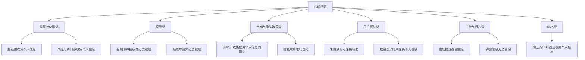
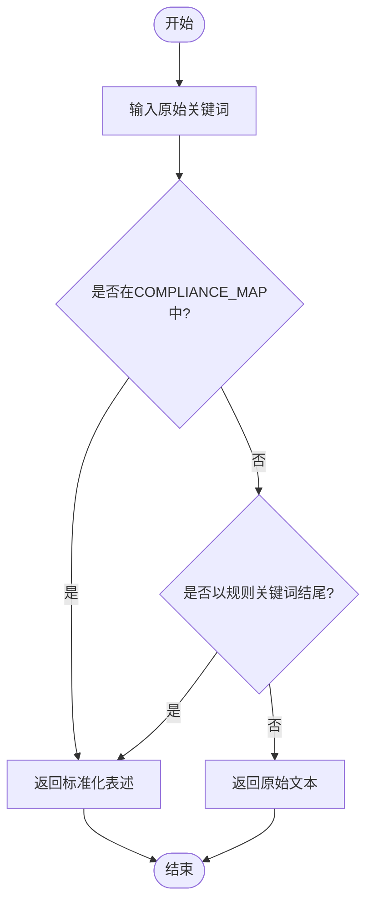
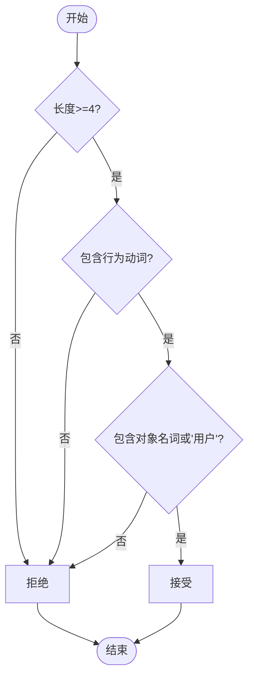
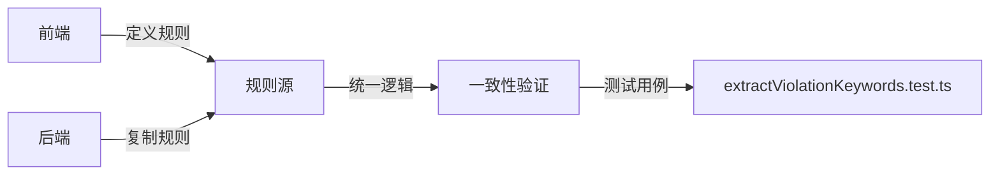

# 合规规则体系

<cite>
**本文档引用文件**   
- [compliance_rules.ts](file://src/db/compliance_rules.ts)
- [api.ts](file://src/db/api.ts)
- [extractViolationKeywords.test.ts](file://src/db/extractViolationKeywords.test.ts)
- [20251219120000_optimize_violation_extraction.sql](file://supabase/migrations/20251219120000_optimize_violation_extraction.sql)
- [ViolationAnalysisPage.tsx](file://src/pages/ViolationAnalysisPage.tsx)
- [api-optimized.ts](file://src/db/api-optimized.ts)
</cite>

## 目录
1. [引言](#引言)
2. [合规规则库设计](#合规规则库设计)
3. [规则匹配算法](#规则匹配算法)
4. [规则库维护机制](#规则库维护机制)
5. [规则冲突处理](#规则冲突处理)
6. [实际应用案例](#实际应用案例)
7. [结论](#结论)

## 引言
本系统基于《个人信息保护法》及相关监管通报标准，构建了一套完整的合规规则体系。该体系通过标准化的规则映射、智能的关键词提取和统一的数据分析，实现了对违规内容的自动化识别与分类。系统不仅支持对原始违规描述进行标准化处理，还能在数据清洗和分析过程中提供一致的统计口径，为监管分析提供可靠的数据支持。

## 合规规则库设计

合规规则库的核心是`COMPLIANCE_MAP`结构，它定义了从模糊、不完整的违规描述到标准法律表述的映射关系。该映射表按照违规类型分为多个类别，确保了规则的系统性和完整性。

### 规则分类逻辑
规则库将违规问题分为六大类，每类包含具体的违规行为描述：

- **收集与使用类**：涵盖超范围、违规、未经同意等个人信息处理行为
- **权限类**：包括强制授权、过度索取、私自调用等权限相关违规
- **告知与隐私政策类**：涉及未明示、未公开、难以访问等告知义务问题
- **用户权益类**：包含注销、删除、更正、撤回等用户权利保障问题
- **广告与行为类**：涵盖违规推送、弹窗无法关闭、强制更新等用户干扰行为
- **SDK类**：针对第三方SDK违规收集个人信息的问题

**图源**
- [compliance_rules.ts](file://src/db/compliance_rules.ts#L8-L60)

**本节来源**
- [compliance_rules.ts](file://src/db/compliance_rules.ts#L7-L61)

## 规则匹配算法

规则匹配算法是合规体系的核心处理逻辑，它将原始的违规描述文本转换为标准化的关键词，为后续的数据分析提供统一的输入。

### 标准化处理流程
算法通过`normalizeKeyword`函数实现关键词的标准化，处理流程如下：

1. **直接查表补全**：检查输入关键词是否存在于`COMPLIANCE_MAP`中，若存在则直接返回对应的标准化表述
2. **模糊匹配补全**：对于以规则关键词结尾的描述（如"存在超范围收集"），识别出核心关键词并进行补全
3. **原样返回**：对于无法匹配的描述，返回原始文本作为"其他/未分类"问题

**图源**
- [compliance_rules.ts](file://src/db/compliance_rules.ts#L75-L94)

### 完整性校验机制
系统通过`validateKeyword`函数对标准化后的关键词进行完整性校验，确保其符合法律表述的基本要求：

- **行为要素校验**：检查是否包含收集、使用、处理等行为动词
- **对象要素校验**：检查是否包含个人信息、隐私政策、权限等对象名词
- **长度校验**：确保关键词长度不低于4个字符

**图源**
- [compliance_rules.ts](file://src/db/compliance_rules.ts#L102-L110)

### 综合提取流程
在实际应用中，`extractViolationKeywords`函数整合了正则匹配和规则映射，实现完整的关键词提取：

1. **文本预处理**：将中文分号统一为英文分号，并按分号切割文本
2. **正则匹配**：使用预定义的正则模式匹配各类违规描述
3. **智能补全**：对匹配到的关键词调用`normalizeKeyword`进行标准化
4. **兜底处理**：对未匹配的适长文本直接进行标准化后保留

**本节来源**
- [api.ts](file://src/db/api.ts#L2163-L2256)
- [compliance_rules.ts](file://src/db/compliance_rules.ts#L75-L110)

## 规则库维护机制

合规规则库采用前后端协同的维护机制，确保规则的一致性和可扩展性。

### 前后端规则同步
系统实现了前后端规则逻辑的统一，避免了统计口径不一致的问题：

- **前端规则**：在`compliance_rules.ts`中定义`COMPLIANCE_MAP`和正则模式
- **后端规则**：在SQL迁移文件中复制相同的正则模式和补全逻辑
- **同步机制**：通过测试用例验证前后端处理结果的一致性

**图源**
- [20251219120000_optimize_violation_extraction.sql](file://supabase/migrations/20251219120000_optimize_violation_extraction.sql#L18-L59)
- [api.ts](file://src/db/api.ts#L2170-L2211)

### 扩展方式
新增监管要求的集成流程如下：

1. **前端扩展**：在`compliance_rules.ts`中添加新的映射规则
2. **后端同步**：在SQL迁移文件中更新`extract_violation_keywords`函数
3. **测试验证**：更新测试用例，确保新规则正确生效
4. **部署上线**：通过数据库迁移同步规则变更

**本节来源**
- [compliance_rules.ts](file://src/db/compliance_rules.ts#L7-L61)
- [20251219120000_optimize_violation_extraction.sql](file://supabase/migrations/20251219120000_optimize_violation_extraction.sql#L18-L59)

## 规则冲突处理

系统通过明确的优先级判定逻辑处理规则冲突，确保处理结果的确定性。

### 优先级判定逻辑
当一个文本片段匹配多个规则时，系统采用以下策略：

- **多匹配策略**：允许一个片段匹配多个规则，确保不遗漏违规问题
- **去重处理**：对最终结果进行去重，避免重复统计
- **长度限制**：对过长的匹配结果进行截断，确保数据质量

### 冲突处理示例
考虑以下场景：
- 输入文本："APP强制授权且超范围收集"
- 处理过程：
  1. 按分号切割（无分号，整个文本作为一个片段）
  2. 正则匹配到"强制授权"和"超范围收集"
  3. 分别补全为"强制用户授权非必要权限"和"超范围收集个人信息"
  4. 返回两个标准化关键词

这种处理方式确保了复合违规问题能够被完整识别和记录。

**本节来源**
- [20251219120000_optimize_violation_extraction.sql](file://supabase/migrations/20251219120000_optimize_violation_extraction.sql#L117-L119)
- [api.ts](file://src/db/api.ts#L2224-L2245)

## 实际应用案例

合规规则体系在数据清洗和分析中发挥着关键作用，以下通过具体案例展示其应用效果。

### 数据清洗应用
在案例导入过程中，系统自动对违规内容进行标准化处理：

- **原始数据**："超范围收集；强制授权；未提供隐私政策"
- **处理过程**：
  1. 按分号切割为三个片段
  2. 分别匹配并补全为标准表述
  3. 去重后存储为标准化关键词数组
- **清洗结果**：["超范围收集个人信息", "强制用户授权非必要权限", "未提供隐私政策"]

### 数据分析应用
在违规分析页面，标准化后的关键词支持多维度统计分析：

**图源**
- [ViolationAnalysisPage.tsx](file://src/pages/ViolationAnalysisPage.tsx#L140-L234)

### 性能优化效果
通过将关键词提取逻辑下沉到数据库层，系统实现了性能优化：

- **前端处理**：每次请求都需要在客户端执行正则匹配和规则映射
- **后端处理**：通过RPC函数在数据库层完成关键词提取
- **优化效果**：减少客户端计算负担，提高响应速度，确保统计口径统一

**本节来源**
- [ViolationAnalysisPage.tsx](file://src/pages/ViolationAnalysisPage.tsx#L104-L118)
- [api-optimized.ts](file://src/db/api-optimized.ts#L221-L255)

## 结论
本合规规则体系通过标准化的`COMPLIANCE_MAP`结构、智能化的匹配算法和前后端协同的维护机制，实现了对违规内容的高效、准确处理。系统不仅能够将模糊的原始描述转换为统一的法律表述，还通过完整性校验确保了数据质量。规则库的模块化设计支持快速扩展，能够灵活应对新的监管要求。在实际应用中，该体系显著提升了数据清洗和分析的效率与准确性，为监管决策提供了可靠的数据支持。