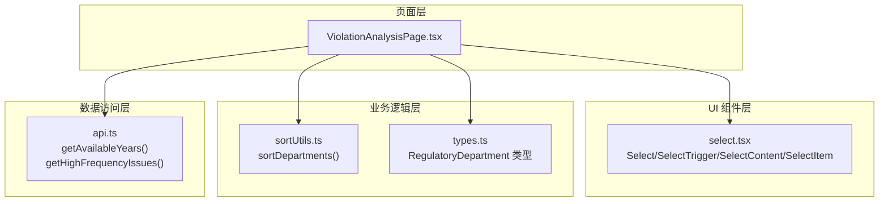
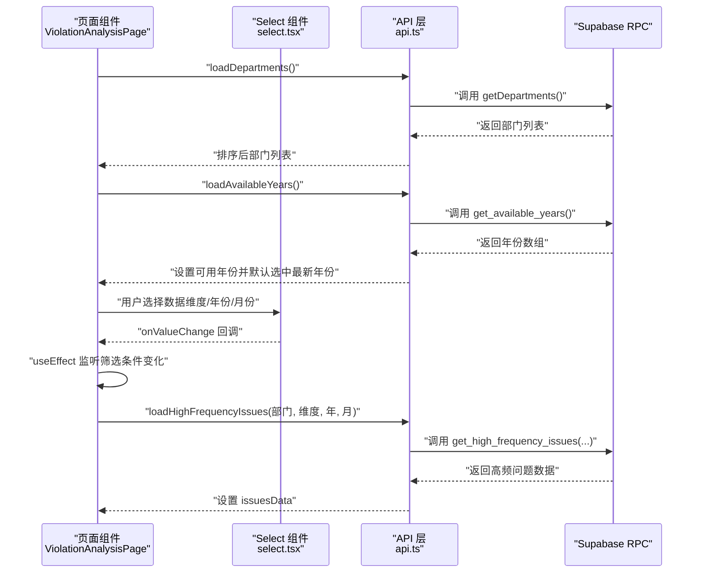
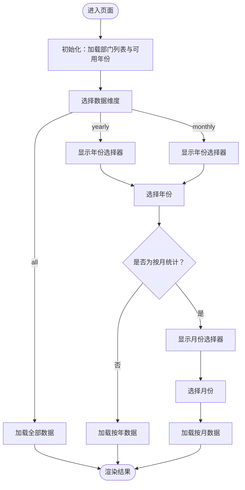
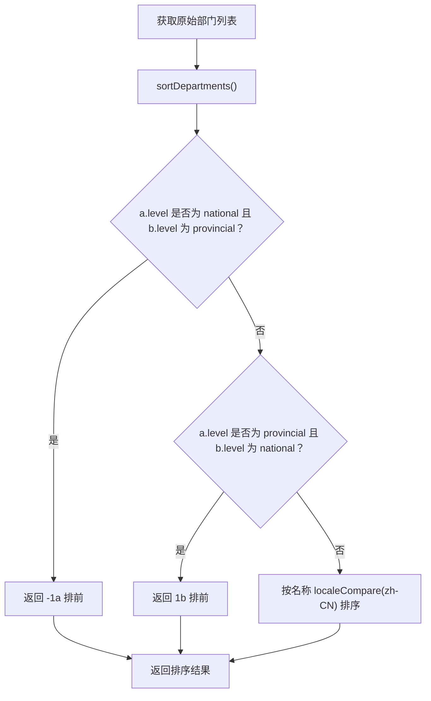
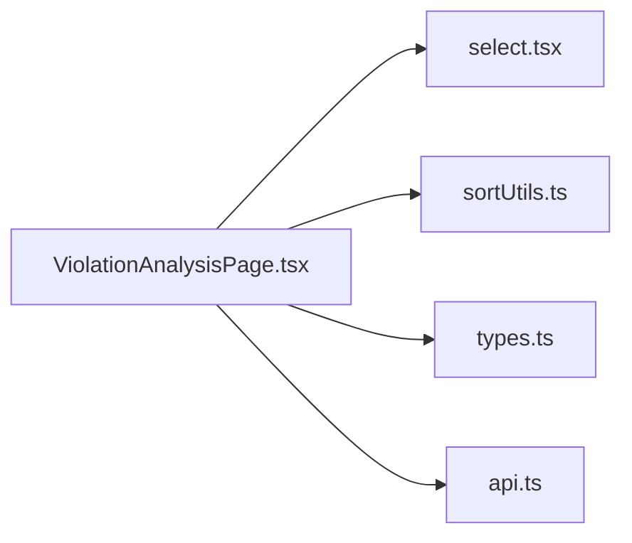

# 筛选条件组件

<cite>
**本文引用的文件**
- [ViolationAnalysisPage.tsx](file://src/pages/ViolationAnalysisPage.tsx)
- [api.ts](file://src/db/api.ts)
- [select.tsx](file://src/components/ui/select.tsx)
- [sortUtils.ts](file://src/utils/sortUtils.ts)
- [types.ts](file://src/types/types.ts)
</cite>

## 目录
1. [简介](#简介)
2. [项目结构](#项目结构)
3. [核心组件](#核心组件)
4. [架构总览](#架构总览)
5. [详细组件分析](#详细组件分析)
6. [依赖关系分析](#依赖关系分析)
7. [性能考量](#性能考量)
8. [故障排查指南](#故障排查指南)
9. [结论](#结论)

## 简介
本文件围绕“筛选条件组件”的实现进行深入说明，聚焦以下目标：
- 使用 Radix UI Select 组件构建监管部门、数据维度、年份和月份的下拉选择器；
- 实现多级条件联动逻辑：选择“按年/按月统计”时动态显示年份/月份选择器；
- 解释数据维度状态管理（all/yearly/monthly）及其对数据加载的影响；
- 描述可用年份的动态加载机制（getAvailableYears API）及默认选中最新年份的用户体验；
- 展示筛选条件变化时如何触发高频问题数据的重新加载；
- 处理部门列表的排序显示（sortDepartments 工具函数）。

## 项目结构
筛选条件组件位于“问题分析”页面中，采用 Radix UI Select 构建下拉选择器，配合自定义工具函数与数据库 API 完成联动与数据加载。

图表来源
- [ViolationAnalysisPage.tsx](file://src/pages/ViolationAnalysisPage.tsx#L248-L328)
- [select.tsx](file://src/components/ui/select.tsx#L1-L160)
- [sortUtils.ts](file://src/utils/sortUtils.ts#L1-L18)
- [types.ts](file://src/types/types.ts#L14-L20)
- [api.ts](file://src/db/api.ts#L2853-L2933)

章节来源
- [ViolationAnalysisPage.tsx](file://src/pages/ViolationAnalysisPage.tsx#L248-L328)
- [select.tsx](file://src/components/ui/select.tsx#L1-L160)
- [sortUtils.ts](file://src/utils/sortUtils.ts#L1-L18)
- [types.ts](file://src/types/types.ts#L14-L20)
- [api.ts](file://src/db/api.ts#L2853-L2933)

## 核心组件
- 页面组件：问题分析页面（ViolationAnalysisPage），负责组织筛选区域与数据展示卡片。
- 下拉选择器：基于 Radix UI Select 的 Select/SelectTrigger/SelectContent/SelectItem 组合。
- 数据维度状态：all/yearly/monthly，驱动年/月选择器的显隐与数据加载策略。
- 年份加载：通过 getAvailableYears RPC 获取可用年份并默认选中最新年份。
- 部门排序：sortDepartments 按“国家级优先、省级其次、同级别按名称排序”。

章节来源
- [ViolationAnalysisPage.tsx](file://src/pages/ViolationAnalysisPage.tsx#L248-L328)
- [api.ts](file://src/db/api.ts#L2853-L2933)
- [sortUtils.ts](file://src/utils/sortUtils.ts#L1-L18)

## 架构总览
筛选条件组件的运行流程如下：初始化加载部门与年份；根据数据维度选择联动显示年/月选择器；筛选条件变化时触发高频问题数据的重新加载；部门列表在渲染前进行排序。

图表来源
- [ViolationAnalysisPage.tsx](file://src/pages/ViolationAnalysisPage.tsx#L70-L128)
- [api.ts](file://src/db/api.ts#L2853-L2933)
- [select.tsx](file://src/components/ui/select.tsx#L1-L160)

## 详细组件分析

### 1) Radix UI Select 组件封装与使用
- Select 根节点、SelectTrigger 触发器、SelectContent 内容区、SelectItem 选项项均来自 Radix UI React Select。
- SelectTrigger 默认展示当前选中值；SelectContent 支持滚动条与动画；SelectItem 显示勾选指示器。
- 在页面中以 Select 包裹 SelectTrigger 与 SelectContent，并在 SelectItem 中提供可选项。

章节来源
- [select.tsx](file://src/components/ui/select.tsx#L1-L160)
- [ViolationAnalysisPage.tsx](file://src/pages/ViolationAnalysisPage.tsx#L248-L328)

### 2) 多级条件联动逻辑
- 数据维度（dataDimension）为 all/yearly/monthly：
  - 当选择 yearly 或 monthly 时，显示“选择年份”下拉；
  - 当选择 monthly 时，额外显示“选择月份”下拉；
  - 切换到 yearly/monthly 时，若尚未选中年份则默认选中最新年份。
- 年份与月份的选择通过 onValueChange 更新对应状态，从而触发数据加载。

图表来源
- [ViolationAnalysisPage.tsx](file://src/pages/ViolationAnalysisPage.tsx#L274-L325)
- [api.ts](file://src/db/api.ts#L2853-L2933)

章节来源
- [ViolationAnalysisPage.tsx](file://src/pages/ViolationAnalysisPage.tsx#L274-L325)

### 3) 数据维度状态管理与数据加载影响
- 状态：
  - selectedDepartment：当前选中的监管部门（支持“全部部门”）；
  - dataDimension：all/yearly/monthly；
  - selectedYear：选中的年份；
  - selectedMonth：选中的月份（仅按月统计时生效）。
- 数据加载策略：
  - 当 dataDimension 为 all 时，直接加载全部数据；
  - 当 dataDimension 为 yearly 或 monthly 且已选择年份时，加载对应年/月数据；
  - 仅当筛选条件满足上述条件时才触发加载，避免无效请求。
- 参数传递给 getHighFrequencyIssues：
  - departmentId：未选“全部部门”时传入；
  - dimension：all/yearly/monthly；
  - year：yearly 或 monthly 时传入；
  - month：monthly 时传入；
  - limit：固定为 10。

章节来源
- [ViolationAnalysisPage.tsx](file://src/pages/ViolationAnalysisPage.tsx#L70-L128)
- [api.ts](file://src/db/api.ts#L2895-L2933)

### 4) 可用年份的动态加载与默认选中最新年份
- 动态加载：
  - 通过 getAvailableYears 调用 Supabase RPC 函数 get_available_years；
  - 若 RPC 返回空或失败，则回退到当前年份；
  - 返回的年份数组按降序排列，保证最新年份在前。
- 默认选中：
  - 页面初始化时将 availableYears 设置后，自动选择第一个元素作为默认年份；
  - 切换数据维度为 yearly/monthly 且未选年份时，也自动补选最新年份。

章节来源
- [ViolationAnalysisPage.tsx](file://src/pages/ViolationAnalysisPage.tsx#L89-L101)
- [api.ts](file://src/db/api.ts#L2853-L2892)

### 5) 部门列表排序显示（sortDepartments）
- 排序规则：
  - 国家级部门优先于省级部门；
  - 同级别按名称进行本地化排序（zh-CN）。
- 使用方式：
  - 加载部门列表后，调用 sortDepartments 进行排序；
  - 将排序后的列表渲染到 SelectItem 中。

图表来源
- [sortUtils.ts](file://src/utils/sortUtils.ts#L1-L18)
- [ViolationAnalysisPage.tsx](file://src/pages/ViolationAnalysisPage.tsx#L77-L87)
- [types.ts](file://src/types/types.ts#L14-L20)

章节来源
- [sortUtils.ts](file://src/utils/sortUtils.ts#L1-L18)
- [ViolationAnalysisPage.tsx](file://src/pages/ViolationAnalysisPage.tsx#L77-L87)
- [types.ts](file://src/types/types.ts#L14-L20)

### 6) 筛选条件变化触发高频问题数据重新加载
- 依赖监听：
  - useEffect 监听 selectedDepartment、dataDimension、selectedYear、selectedMonth；
  - 当上述任一状态变化且满足加载条件时，执行 loadHighFrequencyIssues。
- 请求参数：
  - departmentId：未选“全部部门”时传入；
  - dimension：all/yearly/monthly；
  - year：yearly 或 monthly 时传入；
  - month：monthly 时传入；
  - limit：10。
- 错误处理：
  - 捕获异常并提示用户，同时清空数据，避免脏数据渲染。

章节来源
- [ViolationAnalysisPage.tsx](file://src/pages/ViolationAnalysisPage.tsx#L70-L128)
- [api.ts](file://src/db/api.ts#L2895-L2933)

## 依赖关系分析
- 页面组件依赖：
  - UI 组件：select.tsx 提供 Select/SelectTrigger/SelectContent/SelectItem；
  - 工具函数：sortUtils.ts 的 sortDepartments；
  - 类型定义：types.ts 的 RegulatoryDepartment；
  - 数据访问：api.ts 的 getAvailableYears 与 getHighFrequencyIssues。
- 耦合与内聚：
  - ViolationAnalysisPage 对外仅暴露 onValueChange 回调，内部通过状态与 useEffect 控制数据流；
  - sortDepartments 与 getAvailableYears 与页面解耦，便于复用与测试。

图表来源
- [ViolationAnalysisPage.tsx](file://src/pages/ViolationAnalysisPage.tsx#L248-L328)
- [select.tsx](file://src/components/ui/select.tsx#L1-L160)
- [sortUtils.ts](file://src/utils/sortUtils.ts#L1-L18)
- [types.ts](file://src/types/types.ts#L14-L20)
- [api.ts](file://src/db/api.ts#L2853-L2933)

章节来源
- [ViolationAnalysisPage.tsx](file://src/pages/ViolationAnalysisPage.tsx#L248-L328)
- [select.tsx](file://src/components/ui/select.tsx#L1-L160)
- [sortUtils.ts](file://src/utils/sortUtils.ts#L1-L18)
- [types.ts](file://src/types/types.ts#L14-L20)
- [api.ts](file://src/db/api.ts#L2853-L2933)

## 性能考量
- 渲染优化：
  - 仅在筛选条件满足加载条件时发起请求，减少不必要的网络与计算开销；
  - 部门列表排序在内存中完成，复杂度 O(n log n)，对中小规模列表影响有限。
- 数据缓存：
  - 年份列表与部门列表在页面生命周期内缓存，避免重复请求；
  - 高频问题数据按筛选条件缓存，避免重复渲染。
- 交互体验：
  - 默认选中最新年份，降低用户操作成本；
  - 按需显示年/月选择器，避免冗余 UI。

## 故障排查指南
- 年份列表为空或加载失败
  - 现象：页面初始化后年份列表为空或默认年份异常；
  - 排查：检查 RPC 函数 get_available_years 是否存在且返回有效数据；确认 API 层错误分支是否正确回退到当前年份。
  - 参考路径
    - [api.ts](file://src/db/api.ts#L2853-L2892)
- 高频问题数据为空
  - 现象：筛选条件满足但无数据；
  - 排查：确认 get_high_frequency_issues 的参数组合是否正确（维度、年、月、部门）；检查 Supabase RPC 返回结构。
  - 参考路径
    - [api.ts](file://src/db/api.ts#L2895-L2933)
    - [ViolationAnalysisPage.tsx](file://src/pages/ViolationAnalysisPage.tsx#L104-L128)
- 部门排序不符合预期
  - 现象：国家级与省级部门顺序不正确；
  - 排查：确认 sortDepartments 的比较逻辑；检查 RegulatoryDepartment.level 字段值是否符合 national/provincial。
  - 参考路径
    - [sortUtils.ts](file://src/utils/sortUtils.ts#L1-L18)
    - [types.ts](file://src/types/types.ts#L14-L20)
- 下拉选择器无法显示或滚动异常
  - 现象：SelectContent 不显示或滚动条无效；
  - 排查：确认 Radix UI Portal 与 viewport 的样式类是否正确；检查 SelectTrigger/Content 的尺寸与定位。
  - 参考路径
    - [select.tsx](file://src/components/ui/select.tsx#L70-L100)

## 结论
该筛选条件组件通过 Radix UI Select 实现清晰的下拉交互，结合数据维度状态与联动逻辑，实现了“按年/按月统计”的灵活筛选。借助 getAvailableYears 与 sortDepartments，组件在可用性与易用性方面表现良好。通过 useEffect 的依赖监听，筛选条件变化能够及时触发高频问题数据的重新加载，确保界面数据与用户选择保持一致。