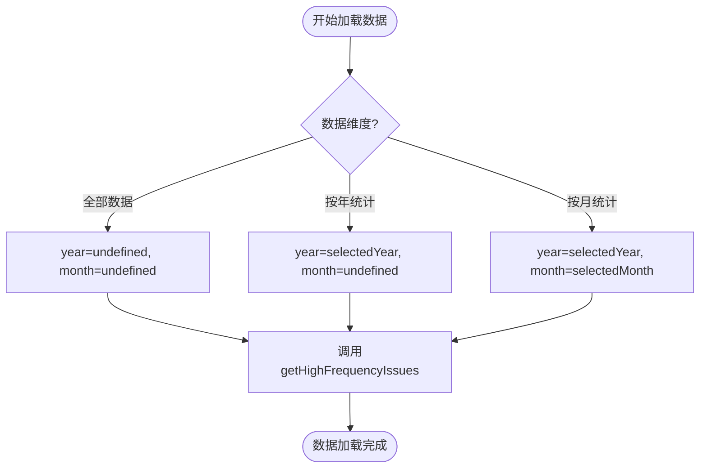
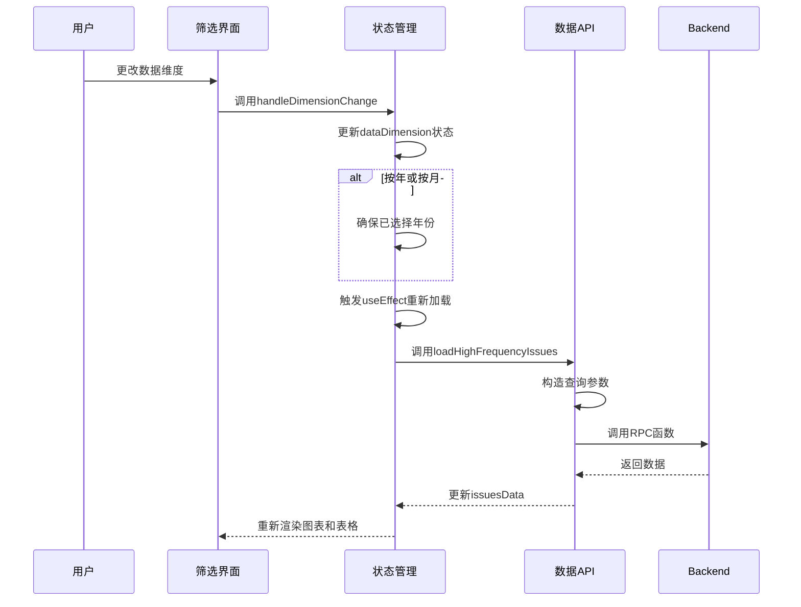
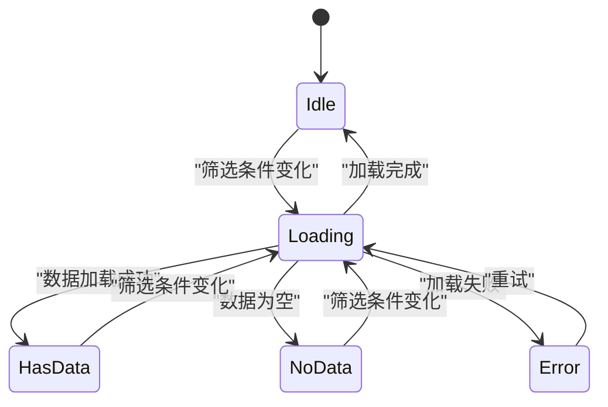

# 统计分析功能

<cite>
**本文档引用文件**  
- [ViolationAnalysisPage.tsx](file://src/pages/ViolationAnalysisPage.tsx)
- [PieChart.tsx](file://src/components/charts/PieChart.tsx)
- [api.ts](file://src/db/api.ts)
- [colors.ts](file://src/lib/colors.ts)
- [20251219100000_align_high_frequency_issues.sql](file://supabase/migrations/20251219100000_align_high_frequency_issues.sql)
- [compliance_rules.ts](file://src/db/compliance_rules.ts)
- [sortUtils.ts](file://src/utils/sortUtils.ts)
</cite>

## 目录
1. [引言](#引言)
2. [饼图实现细节](#饼图实现细节)
3. [数据维度筛选机制](#数据维度筛选机制)
4. [高频问题表格展示逻辑](#高频问题表格展示逻辑)
5. [筛选条件组件设计](#筛选条件组件设计)
6. [数据加载与用户体验](#数据加载与用户体验)
7. [结论](#结论)

## 引言

违规问题分析功能旨在通过数据可视化手段，对监管通报中的高频违规问题进行量化分析。该功能以饼图和表格的形式展示TOP 10高频违规问题的分布情况，支持多维度筛选和交互式探索。系统通过后端RPC函数实现高效的数据聚合与计算，前端采用响应式设计确保在不同设备上的良好体验。

**Section sources**
- [ViolationAnalysisPage.tsx](file://src/pages/ViolationAnalysisPage.tsx#L25-L405)

## 饼图实现细节

### ECharts配置项设置

饼图采用ECharts作为可视化引擎，通过`ReactECharts`组件集成。核心配置项包括：

- **tooltip**: 提供悬停提示，显示违规问题名称、频次和占比
- **legend**: 图例根据屏幕尺寸动态调整布局，小屏幕采用底部横向滚动布局，大屏幕采用右侧纵向布局
- **series**: 饼图系列配置了圆角边框、白色描边和阴影效果，提升视觉层次感

```mermaid
classDiagram
class PieChartConfig {
+tooltip : Object
+legend : Object
+series : Array
+getPieChartOption() : Object
}
PieChartConfig --> "1" "1" ViolationAnalysisPage : 配置生成
PieChartConfig --> "1" "1" ECharts : 渲染
```

**Diagram sources**
- [ViolationAnalysisPage.tsx](file://src/pages/ViolationAnalysisPage.tsx#L139-L234)

### 响应式布局实现逻辑

响应式布局通过监听容器宽度变化来实现。组件使用`useRef`获取图表容器的引用，并在`useEffect`中注册窗口大小变化事件监听器。当容器宽度小于768px时，系统判定为小屏幕设备，自动调整以下布局参数：

- 图例方向：从垂直(`vertical`)变为水平(`horizontal`)
- 饼图半径：从`['40%', '70%']`调整为`['30%', '55%']`
- 饼图中心位置：从`['40%', '50%']`调整为`['50%', '40%']`

这种自适应机制确保了在移动设备上图表和图例都能完整显示。

**Section sources**
- [ViolationAnalysisPage.tsx](file://src/pages/ViolationAnalysisPage.tsx#L38-L68)
- [ViolationAnalysisPage.tsx](file://src/pages/ViolationAnalysisPage.tsx#L145-L147)

### 配色方案选择

系统采用统一的配色方案，确保视觉一致性。配色定义在`src/lib/colors.ts`文件中，基于HSL色彩模型，包含10种预定义颜色：

```typescript
export const chartPalette = [
  'hsl(213, 78%, 35%)',  // 蓝色
  'hsl(142, 71%, 35%)',  // 绿色
  'hsl(18, 95%, 55%)',   // 橙色
  // ... 其他颜色
];
```

这些颜色按顺序分配给饼图的各个扇区，即使数据排序发生变化，相同位置的扇区仍保持相同的颜色，便于用户跨分析进行比较。

**Section sources**
- [colors.ts](file://src/lib/colors.ts#L37-L49)
- [ViolationAnalysisPage.tsx](file://src/pages/ViolationAnalysisPage.tsx#L13)
- [ViolationAnalysisPage.tsx](file://src/pages/ViolationAnalysisPage.tsx#L228-L229)

## 数据维度筛选机制

### 筛选维度类型

系统支持三种数据维度筛选：
- **全部数据**: 分析所有时间段的违规问题
- **按年统计**: 分析指定年份的违规问题
- **按月统计**: 分析指定年月的违规问题

### 状态管理

筛选状态通过React的`useState`钩子进行管理，定义了以下状态变量：

```mermaid
erDiagram
STATE :: {
selectedDepartment: string
dataDimension: string
selectedYear: string
selectedMonth: string
loading: boolean
issuesData: Array
}
FILTER :: {
department: string
dimension: string
year: string
month: string
}
STATE ||--o{ FILTER : "包含"
```

当用户更改筛选条件时，`useEffect`钩子会检测到依赖项的变化，自动触发数据重新加载。

### 筛选逻辑实现

筛选逻辑在`loadHighFrequencyIssues`函数中实现，根据当前筛选状态构造后端查询参数：

- `departmentId`: 监管部门ID，`'all'`表示不限制
- `dimension`: 数据维度 (`all`, `yearly`, `monthly`)
- `year`: 年份，仅在`yearly`或`monthly`维度时使用
- `month`: 月份，仅在`monthly`维度时使用



**Diagram sources**
- [ViolationAnalysisPage.tsx](file://src/pages/ViolationAnalysisPage.tsx#L108-L117)

**Section sources**
- [ViolationAnalysisPage.tsx](file://src/pages/ViolationAnalysisPage.tsx#L27-L32)
- [ViolationAnalysisPage.tsx](file://src/pages/ViolationAnalysisPage.tsx#L71-L75)
- [ViolationAnalysisPage.tsx](file://src/pages/ViolationAnalysisPage.tsx#L104-L127)

## 高频问题表格展示逻辑

### 排名计算

表格中的排名基于违规问题的出现频次进行降序排列。系统返回的数据已经按频次从高到低排序，前端只需根据数组索引生成排名：

```typescript
{issuesData.map((item, index) => (
  <TableCell className="font-medium">#{index + 1}</TableCell>
))}
```

### 频次计算

频次数据由后端RPC函数`get_high_frequency_issues`直接提供。该函数通过以下步骤计算频次：

1. 过滤符合条件的案例
2. 提取每个案例的违规关键词
3. 按关键词分组并统计出现次数
4. 按频次降序排列

### 占比计算

占比通过以下公式计算：
```
占比 = (单个问题频次 / 所有问题总频次) × 100%
```

后端在SQL查询中直接计算占比，确保精度和性能：

```sql
ROUND((ic.freq::numeric / NULLIF(tc.total, 0) * 100), 2) as percentage
```

表格中占比以百分比形式显示，并保留两位小数。

**Section sources**
- [ViolationAnalysisPage.tsx](file://src/pages/ViolationAnalysisPage.tsx#L372-L387)
- [20251219100000_align_high_frequency_issues.sql](file://supabase/migrations/20251219100000_align_high_frequency_issues.sql#L57)

## 筛选条件组件设计

### 交互设计

筛选条件组件采用卡片式布局，包含四个主要筛选项：

1. **监管部门**: 下拉选择框，支持选择全部部门或特定监管部门
2. **数据维度**: 下拉选择框，切换"全部数据"、"按年统计"、"按月统计"
3. **选择年份**: 条件性显示，当选择"按年"或"按月"时出现
4. **选择月份**: 条件性显示，当选择"按月"时出现

组件采用响应式网格布局，在小屏幕上堆叠显示，在大屏幕上并排显示。

### 技术实现

筛选组件基于ShadCN UI的`Select`组件构建，通过条件渲染控制不同筛选项的显示：



**Diagram sources**
- [ViolationAnalysisPage.tsx](file://src/pages/ViolationAnalysisPage.tsx#L249-L328)

**Section sources**
- [ViolationAnalysisPage.tsx](file://src/pages/ViolationAnalysisPage.tsx#L249-L328)
- [ViolationAnalysisPage.tsx](file://src/pages/ViolationAnalysisPage.tsx#L130-L137)

## 数据加载与用户体验

### 数据加载流程

数据加载采用异步模式，包含以下步骤：

1. 初始化时加载部门列表和可用年份
2. 当筛选条件变化时，显示加载状态
3. 调用后端API获取高频问题数据
4. 更新状态并重新渲染UI
5. 处理加载完成或错误状态

### 错误处理

系统实现了完善的错误处理机制：

- **网络错误**: 捕获API调用异常，显示错误提示
- **数据错误**: 验证返回数据的有效性，处理空数据情况
- **用户反馈**: 使用`toast`组件提供视觉反馈

```typescript
try {
  const data = await getHighFrequencyIssues(...);
  setIssuesData(data);
} catch (error) {
  console.error('加载高频问题数据失败:', error);
  toast.error('加载高频问题数据失败');
  setIssuesData([]);
} finally {
  setLoading(false);
}
```

### 加载状态设计

加载状态通过骨架屏(Skeleton)组件实现，提供良好的用户体验：

- **加载中**: 显示灰色骨架屏，模拟图表和表格的布局
- **无数据**: 显示"暂无数据"提示，引导用户调整筛选条件
- **加载完成**: 平滑过渡到实际数据展示



**Diagram sources**
- [ViolationAnalysisPage.tsx](file://src/pages/ViolationAnalysisPage.tsx#L339-L344)
- [ViolationAnalysisPage.tsx](file://src/pages/ViolationAnalysisPage.tsx#L394-L399)

**Section sources**
- [ViolationAnalysisPage.tsx](file://src/pages/ViolationAnalysisPage.tsx#L35-L36)
- [ViolationAnalysisPage.tsx](file://src/pages/ViolationAnalysisPage.tsx#L106-L127)
- [ViolationAnalysisPage.tsx](file://src/pages/ViolationAnalysisPage.tsx#L339-L399)

## 结论

违规问题分析功能通过前后端协同设计，实现了高效、直观的数据可视化分析。前端采用响应式设计和流畅的交互体验，后端通过优化的SQL查询确保数据处理性能。系统支持多维度筛选，帮助用户深入洞察违规问题的分布规律。未来可考虑增加数据导出、自定义排名数量等增强功能，进一步提升分析能力。