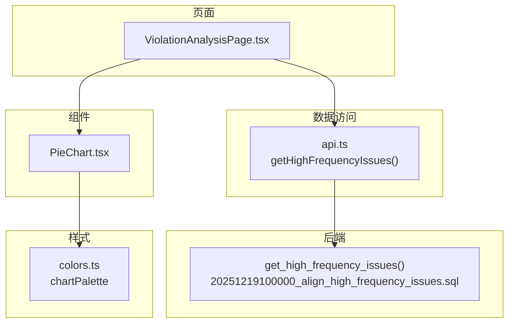
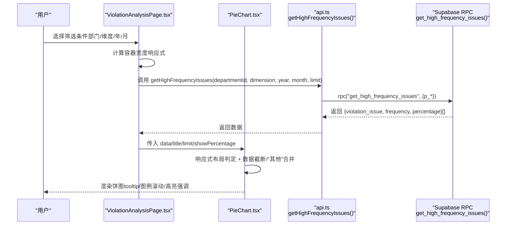
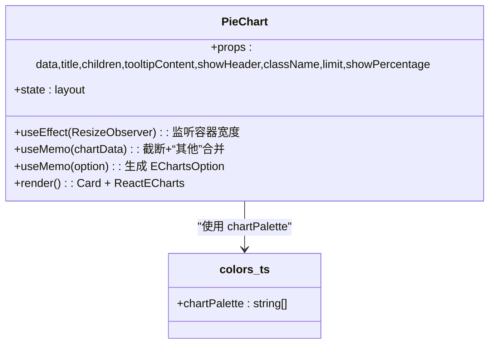
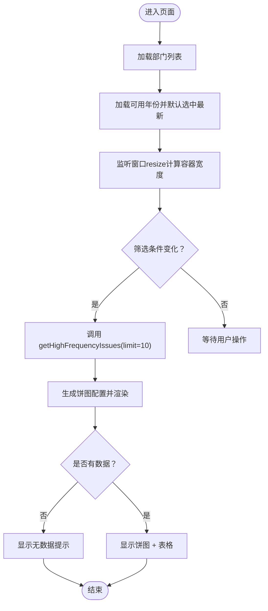
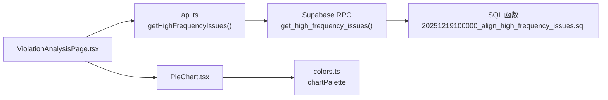

# 饼图分析功能

<cite>
**本文引用的文件**
- [PieChart.tsx](file://src/components/charts/PieChart.tsx)
- [ViolationAnalysisPage.tsx](file://src/pages/ViolationAnalysisPage.tsx)
- [colors.ts](file://src/lib/colors.ts)
- [api.ts](file://src/db/api.ts)
- [20251219100000_align_high_frequency_issues.sql](file://supabase/migrations/20251219100000_align_high_frequency_issues.sql)
</cite>

## 目录
1. [简介](#简介)
2. [项目结构](#项目结构)
3. [核心组件](#核心组件)
4. [架构总览](#架构总览)
5. [详细组件分析](#详细组件分析)
6. [依赖关系分析](#依赖关系分析)
7. [性能考量](#性能考量)
8. [故障排查指南](#故障排查指南)
9. [结论](#结论)

## 简介
本文件围绕“违规问题分布”的饼图分析功能展开，系统性说明 PieChart 组件的 ECharts 配置细节（响应式布局、图例位置与滚动、字体与图标尺寸、配色方案、动画设置），以及在 ViolationAnalysisPage 中的实际使用方式，包括高频问题数据的获取、映射与无数据状态的用户体验设计。同时解释了数据截断与“其他”项合并机制（limit 参数控制显示数量）及图表交互行为（高亮强调、tooltip 格式化、图例滚动）。

## 项目结构
与饼图分析功能直接相关的文件组织如下：
- 组件层：PieChart.tsx（通用饼图组件）
- 页面层：ViolationAnalysisPage.tsx（高频问题分析页面）
- 颜色方案：colors.ts（chartPalette 调色板）
- 数据访问：api.ts（getHighFrequencyIssues RPC）
- 数据模型：20251219100000_align_high_frequency_issues.sql（后端聚合逻辑）

**图表来源**
- [ViolationAnalysisPage.tsx](file://src/pages/ViolationAnalysisPage.tsx#L1-L405)
- [PieChart.tsx](file://src/components/charts/PieChart.tsx#L1-L191)
- [api.ts](file://src/db/api.ts#L2902-L2933)
- [20251219100000_align_high_frequency_issues.sql](file://supabase/migrations/20251219100000_align_high_frequency_issues.sql#L1-L66)
- [colors.ts](file://src/lib/colors.ts#L1-L50)

**章节来源**
- [PieChart.tsx](file://src/components/charts/PieChart.tsx#L1-L191)
- [ViolationAnalysisPage.tsx](file://src/pages/ViolationAnalysisPage.tsx#L1-L405)
- [colors.ts](file://src/lib/colors.ts#L1-L50)
- [api.ts](file://src/db/api.ts#L2902-L2933)
- [20251219100000_align_high_frequency_issues.sql](file://supabase/migrations/20251219100000_align_high_frequency_issues.sql#L1-L66)

## 核心组件
- PieChart 组件：提供响应式布局、图例滚动、高亮强调、tooltip 格式化、配色方案与“其他”项合并等能力；支持传入 limit 控制显示数量。
- ViolationAnalysisPage 页面：负责筛选条件、加载高频问题数据、生成 ECharts 配置并渲染饼图与表格，处理无数据状态与骨架屏。

关键点
- 响应式布局：通过 ResizeObserver + requestAnimationFrame 判定 sm/md/lg 三档布局，动态调整图例方向、位置、字体大小、图标尺寸与饼图半径/中心。
- 数据截断与“其他”合并：根据 limit 或布局阈值决定显示条目数，超出部分汇总为“其他”。
- 交互行为：tooltip 格式化、图例滚动、高亮强调（阴影、放大、百分比突出）。
- 配色方案：使用 chartPalette，保证与首页一致的视觉风格。

**章节来源**
- [PieChart.tsx](file://src/components/charts/PieChart.tsx#L1-L191)
- [ViolationAnalysisPage.tsx](file://src/pages/ViolationAnalysisPage.tsx#L1-L405)
- [colors.ts](file://src/lib/colors.ts#L1-L50)

## 架构总览
下图展示了从页面到组件再到数据访问的整体流程，以及后端 SQL 函数对高频问题的统计与百分比计算。

**图表来源**
- [ViolationAnalysisPage.tsx](file://src/pages/ViolationAnalysisPage.tsx#L1-L405)
- [PieChart.tsx](file://src/components/charts/PieChart.tsx#L1-L191)
- [api.ts](file://src/db/api.ts#L2902-L2933)
- [20251219100000_align_high_frequency_issues.sql](file://supabase/migrations/20251219100000_align_high_frequency_issues.sql#L1-L66)

## 详细组件分析

### PieChart 组件（通用饼图）
职责与特性
- 响应式布局：监听容器宽度，按 sm/md/lg 分类，分别调整图例方向、位置、字体、图标尺寸与饼图半径/中心。
- 数据截断与“其他”合并：根据 limit 或布局阈值（sm:8、md:12、lg:15）截取前 N 项，其余汇总为“其他”，count 为剩余项频次之和。
- 交互与样式：tooltip 格式化、图例滚动、高亮强调（阴影、放大、百分比突出）、标签与引导线可选显示。
- 配色方案：使用 chartPalette，按索引循环取色，保证颜色一致性。

ECharts 配置要点
- animation：关闭动画，避免频繁更新导致闪烁。
- tooltip：触发类型为 item，格式化字符串包含名称、频次与百分比。
- legend：小屏水平底部居中，大屏垂直右侧居中；启用滚动，自定义分页按钮样式与文本样式。
- series.pie：设置圆环内外半径、中心位置、圆角边框、标签与引导线、emphasis 高亮样式（阴影、放大、加粗）。
- data：映射为 {name,value,itemStyle:{color}}，颜色来自 chartPalette。

**图表来源**
- [PieChart.tsx](file://src/components/charts/PieChart.tsx#L1-L191)
- [colors.ts](file://src/lib/colors.ts#L1-L50)

**章节来源**
- [PieChart.tsx](file://src/components/charts/PieChart.tsx#L1-L191)
- [colors.ts](file://src/lib/colors.ts#L1-L50)

### ViolationAnalysisPage 页面（高频问题分析）
职责与特性
- 筛选条件：部门、数据维度（全部/按年/按月）、年份、月份。
- 数据加载：调用 getHighFrequencyIssues，限制返回前 10 项，自动默认选择最新年份。
- 响应式布局：监听窗口 resize，计算容器宽度，驱动饼图配置的响应式差异。
- 交互与体验：加载中显示骨架屏；无数据时显示提示文案；数据存在时左右分栏：左侧饼图、右侧表格。

数据映射
- 将后端返回的 {violation_issue,frequency,percentage} 映射为饼图 series.data，其中 name 为问题名称，value 为频次，颜色来自 chartPalette。
- 为长名称做截断处理，避免图例过宽影响布局。

**图表来源**
- [ViolationAnalysisPage.tsx](file://src/pages/ViolationAnalysisPage.tsx#L1-L405)
- [api.ts](file://src/db/api.ts#L2902-L2933)
- [20251219100000_align_high_frequency_issues.sql](file://supabase/migrations/20251219100000_align_high_frequency_issues.sql#L1-L66)
- [colors.ts](file://src/lib/colors.ts#L1-L50)

**章节来源**
- [ViolationAnalysisPage.tsx](file://src/pages/ViolationAnalysisPage.tsx#L1-L405)
- [api.ts](file://src/db/api.ts#L2902-L2933)
- [20251219100000_align_high_frequency_issues.sql](file://supabase/migrations/20251219100000_align_high_frequency_issues.sql#L1-L66)
- [colors.ts](file://src/lib/colors.ts#L1-L50)

## 依赖关系分析
- ViolationAnalysisPage 依赖 api.ts 的 getHighFrequencyIssues，后者通过 Supabase RPC 调用 get_high_frequency_issues，SQL 函数对违规关键词进行预计算与聚合，返回 violation_issue、frequency、percentage。
- PieChart 组件依赖 colors.ts 的 chartPalette，保证与首页一致的配色。
- 两者共同实现“前端响应式 + 后端聚合”的数据可视化闭环。

**图表来源**
- [ViolationAnalysisPage.tsx](file://src/pages/ViolationAnalysisPage.tsx#L1-L405)
- [PieChart.tsx](file://src/components/charts/PieChart.tsx#L1-L191)
- [api.ts](file://src/db/api.ts#L2902-L2933)
- [20251219100000_align_high_frequency_issues.sql](file://supabase/migrations/20251219100000_align_high_frequency_issues.sql#L1-L66)
- [colors.ts](file://src/lib/colors.ts#L1-L50)

**章节来源**
- [ViolationAnalysisPage.tsx](file://src/pages/ViolationAnalysisPage.tsx#L1-L405)
- [PieChart.tsx](file://src/components/charts/PieChart.tsx#L1-L191)
- [api.ts](file://src/db/api.ts#L2902-L2933)
- [20251219100000_align_high_frequency_issues.sql](file://supabase/migrations/20251219100000_align_high_frequency_issues.sql#L1-L66)
- [colors.ts](file://src/lib/colors.ts#L1-L50)

## 性能考量
- 动画禁用：PieChart 关闭动画，减少频繁更新带来的重绘开销，提升交互流畅度。
- 请求帧节流：通过 ResizeObserver + requestAnimationFrame 避免频繁布局抖动。
- 数据截断：通过 limit 或布局阈值限制显示数量，降低图例渲染与标签绘制成本。
- 渲染器选择：使用 SVG 渲染器，保证清晰度与缩放质量，适合报表场景。
- 骨架屏：页面加载阶段使用骨架屏，改善感知性能。

[本节为通用建议，无需特定文件引用]

## 故障排查指南
- 无数据展示
  - PieChart：当 data.length 为 0 时显示“暂无数据”提示。
  - ViolationAnalysisPage：当 issuesData 为空时显示“暂无数据”提示并建议调整筛选条件。
- 数据截断与“其他”
  - 若发现“其他”项占比异常高，检查 limit 与布局阈值是否合理；必要时增大 limit 或调整布局断点。
- tooltip 格式
  - 若 tooltip 内容不符合预期，确认 tooltip.formatter 是否与数据结构匹配（名称、频次、百分比）。
- 图例滚动
  - 在小屏下图例可能为横向且启用滚动；若滚动按钮不可见，请检查 pageIconSize/pageTextStyle 设置。
- 颜色不一致
  - 确认 chartPalette 是否正确引入，series.data.itemStyle.color 是否按索引取色。
- 后端聚合
  - 若 percentage 异常，检查 SQL 函数是否正确计算 total 并进行百分比四舍五入；确认过滤条件（部门/维度/年/月）是否正确传递。

**章节来源**
- [PieChart.tsx](file://src/components/charts/PieChart.tsx#L1-L191)
- [ViolationAnalysisPage.tsx](file://src/pages/ViolationAnalysisPage.tsx#L1-L405)
- [20251219100000_align_high_frequency_issues.sql](file://supabase/migrations/20251219100000_align_high_frequency_issues.sql#L1-L66)

## 结论
本功能通过 ViolationAnalysisPage 与 PieChart 组件协同，实现了违规问题分布的可视化分析。前端采用响应式布局与数据截断策略，后端通过 SQL 函数进行关键词提取与聚合，确保数据准确性与性能表现。配合 tooltip、图例滚动与高亮强调，提升了交互体验与可读性。建议在生产环境中持续监控 percentage 计算与布局断点，确保跨设备的一致性与可维护性。