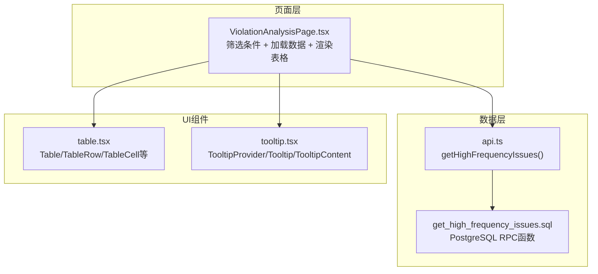
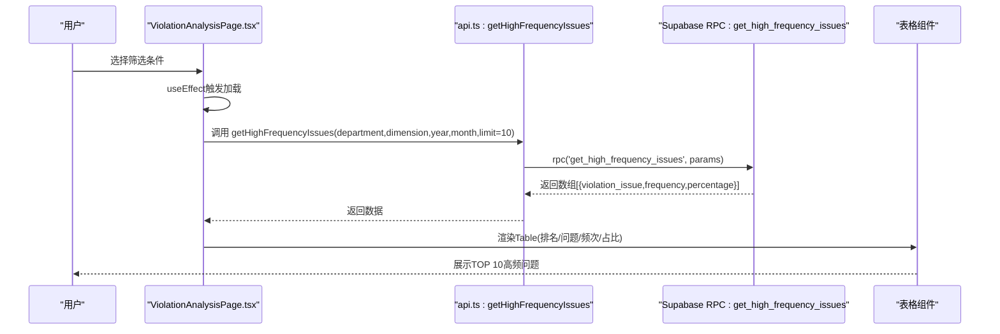
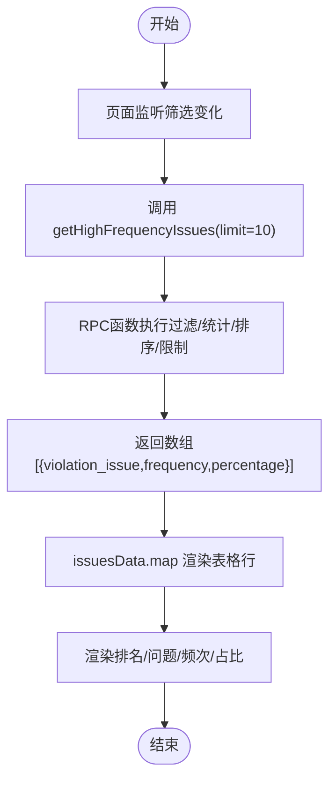
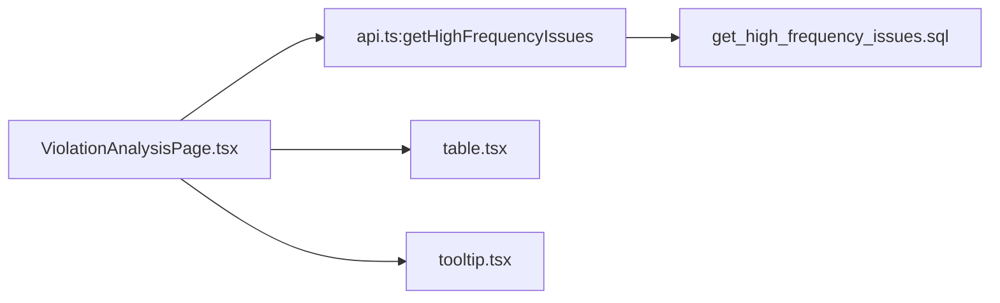

# 高频问题表格

<cite>
**本文引用的文件**
- [ViolationAnalysisPage.tsx](file://src/pages/ViolationAnalysisPage.tsx)
- [api.ts](file://src/db/api.ts)
- [get_high_frequency_issues.sql](file://supabase/migrations/00020_add_high_frequency_issues_function.sql)
- [table.tsx](file://src/components/ui/table.tsx)
- [tooltip.tsx](file://src/components/ui/tooltip.tsx)
</cite>

## 目录
1. [简介](#简介)
2. [项目结构](#项目结构)
3. [核心组件](#核心组件)
4. [架构总览](#架构总览)
5. [详细组件分析](#详细组件分析)
6. [依赖分析](#依赖分析)
7. [性能考虑](#性能考虑)
8. [故障排查指南](#故障排查指南)
9. [结论](#结论)

## 简介
本文件围绕“高频问题表格”功能，聚焦于TOP 10违规问题的列表展示。内容涵盖：
- 表格数据结构设计：排名、违规问题名称、频次、占比四列的展示逻辑
- 排序机制与排名生成：按频次降序排列，排名基于索引+1
- UI设计细节：列宽分配、文本截断处理、鼠标悬停提示、数值右对齐布局
- 数据来源与映射：从getHighFrequencyIssues API获取数据并渲染为表格行
- 空数据状态的友好提示

## 项目结构
高频问题表格位于“违规分析页面”，由前端页面组件负责筛选条件与数据加载，通过数据库RPC函数获取TOP 10高频问题，再以表格形式展示。

图表来源
- [ViolationAnalysisPage.tsx](file://src/pages/ViolationAnalysisPage.tsx#L103-L128)
- [api.ts](file://src/db/api.ts#L2903-L2931)
- [get_high_frequency_issues.sql](file://supabase/migrations/00020_add_high_frequency_issues_function.sql#L35-L84)
- [table.tsx](file://src/components/ui/table.tsx#L1-L115)
- [tooltip.tsx](file://src/components/ui/tooltip.tsx#L1-L62)

章节来源
- [ViolationAnalysisPage.tsx](file://src/pages/ViolationAnalysisPage.tsx#L103-L128)
- [api.ts](file://src/db/api.ts#L2903-L2931)
- [get_high_frequency_issues.sql](file://supabase/migrations/00020_add_high_frequency_issues_function.sql#L35-L84)
- [table.tsx](file://src/components/ui/table.tsx#L1-L115)
- [tooltip.tsx](file://src/components/ui/tooltip.tsx#L1-L62)

## 核心组件
- 违规分析页面组件：负责筛选条件、调用API、加载数据、渲染表格与空态提示
- 数据访问层：封装getHighFrequencyIssues方法，调用Supabase RPC函数
- 数据库RPC函数：按部门、维度、年份、月份筛选，统计频次并计算占比，按频次降序取前N条
- UI表格组件：提供Table/TableHeader/TableBody/TableRow/TableCell等基础能力
- Tooltip组件：提供统一的提示容器，用于长文本溢出时的详细展示

章节来源
- [ViolationAnalysisPage.tsx](file://src/pages/ViolationAnalysisPage.tsx#L103-L128)
- [api.ts](file://src/db/api.ts#L2903-L2931)
- [get_high_frequency_issues.sql](file://supabase/migrations/00020_add_high_frequency_issues_function.sql#L35-L84)
- [table.tsx](file://src/components/ui/table.tsx#L1-L115)
- [tooltip.tsx](file://src/components/ui/tooltip.tsx#L1-L62)

## 架构总览
高频问题表格的数据流如下：
- 用户在页面筛选“监管部门/数据维度/年份/月份”
- 页面组件调用getHighFrequencyIssues(limit=10)
- RPC函数在数据库侧按维度过滤、统计频次、计算占比、降序排序并限制返回条目
- 前端接收数组数据，逐行渲染表格，包含排名、问题名称、频次、占比四列

图表来源
- [ViolationAnalysisPage.tsx](file://src/pages/ViolationAnalysisPage.tsx#L103-L128)
- [api.ts](file://src/db/api.ts#L2903-L2931)
- [get_high_frequency_issues.sql](file://supabase/migrations/00020_add_high_frequency_issues_function.sql#L35-L84)
- [table.tsx](file://src/components/ui/table.tsx#L1-L115)

## 详细组件分析

### 表格数据结构与列设计
- 数据结构
  - 字段：violation_issue（违规问题名称）、frequency（频次）、percentage（占比）
  - 来源：数据库RPC函数返回的数组
- 列设计
  - 排名：固定宽度列，居中显示序号
  - 违规问题：文本截断列，超长文本通过title属性提供完整提示
  - 频次：数值右对齐，强调数字可读性
  - 占比：数值右对齐，使用强调色突出占比信息

章节来源
- [ViolationAnalysisPage.tsx](file://src/pages/ViolationAnalysisPage.tsx#L361-L391)
- [api.ts](file://src/db/api.ts#L2903-L2931)

### 排序机制与排名生成
- 排序机制
  - 数据库侧：RPC函数按频次降序排序
  - 前端渲染：直接使用RPC返回顺序，不二次排序
- 排名生成
  - 前端基于数组索引+1生成排名，保证与数据库排序一致

章节来源
- [get_high_frequency_issues.sql](file://supabase/migrations/00020_add_high_frequency_issues_function.sql#L82-L84)
- [ViolationAnalysisPage.tsx](file://src/pages/ViolationAnalysisPage.tsx#L372-L388)

### UI设计细节
- 列宽分配
  - 排名列：固定宽度
  - 问题列：自适应宽度，配合文本截断
  - 频次/占比列：固定宽度，便于对齐
- 文本截断处理
  - 使用max-w-xs与truncate类控制宽度与截断
  - title属性提供完整文本提示，避免信息丢失
- 数值右对齐布局
  - 频次与占比列采用右对齐，强调数值可读性
- 空数据状态
  - 当issuesData为空时，显示“暂无数据”的友好提示，引导用户调整筛选条件

章节来源
- [ViolationAnalysisPage.tsx](file://src/pages/ViolationAnalysisPage.tsx#L361-L391)
- [ViolationAnalysisPage.tsx](file://src/pages/ViolationAnalysisPage.tsx#L394-L399)

### 数据来源与映射流程
- 页面组件在筛选条件变化时调用getHighFrequencyIssues
- API方法封装Supabase RPC调用，传入部门、维度、年份、月份与limit
- RPC函数执行过滤、统计、排序与限制，返回数组
- 页面组件将数组映射为表格行，渲染四列数据

图表来源
- [ViolationAnalysisPage.tsx](file://src/pages/ViolationAnalysisPage.tsx#L103-L128)
- [api.ts](file://src/db/api.ts#L2903-L2931)
- [get_high_frequency_issues.sql](file://supabase/migrations/00020_add_high_frequency_issues_function.sql#L35-L84)

## 依赖分析
- 组件耦合
  - ViolationAnalysisPage依赖api.ts提供的getHighFrequencyIssues
  - ViolationAnalysisPage依赖table.tsx提供的表格组件
  - ViolationAnalysisPage依赖tooltip.tsx提供的提示能力（通过title属性）
- 外部依赖
  - Supabase RPC函数get_high_frequency_issues
  - shadcn/ui表格与Tooltip组件

图表来源
- [ViolationAnalysisPage.tsx](file://src/pages/ViolationAnalysisPage.tsx#L103-L128)
- [api.ts](file://src/db/api.ts#L2903-L2931)
- [get_high_frequency_issues.sql](file://supabase/migrations/00020_add_high_frequency_issues_function.sql#L35-L84)
- [table.tsx](file://src/components/ui/table.tsx#L1-L115)
- [tooltip.tsx](file://src/components/ui/tooltip.tsx#L1-L62)

章节来源
- [ViolationAnalysisPage.tsx](file://src/pages/ViolationAnalysisPage.tsx#L103-L128)
- [api.ts](file://src/db/api.ts#L2903-L2931)
- [get_high_frequency_issues.sql](file://supabase/migrations/00020_add_high_frequency_issues_function.sql#L35-L84)
- [table.tsx](file://src/components/ui/table.tsx#L1-L115)
- [tooltip.tsx](file://src/components/ui/tooltip.tsx#L1-L62)

## 性能考虑
- 数据量控制：RPC函数限制返回前10条，减少前端渲染压力
- 列宽固定：固定宽度列有助于表格布局稳定，避免频繁重排
- 文本截断：通过max-w-xs与truncate避免超长文本导致的布局抖动
- 空态提示：在无数据时显示简洁提示，避免空表格造成的视觉混乱

## 故障排查指南
- 加载失败
  - 现象：弹出错误提示且issuesData为空
  - 排查：检查网络请求、Supabase服务状态、RPC函数参数是否正确
- 数据为空
  - 现象：显示“暂无数据”，但筛选条件合理
  - 排查：确认筛选维度（部门/年份/月份）是否过于严格；检查cases表中是否存在有效违规内容
- 排序异常
  - 现象：排名与频次不一致
  - 排查：确认RPC函数是否按频次降序排序；前端是否对数据进行了二次排序

章节来源
- [ViolationAnalysisPage.tsx](file://src/pages/ViolationAnalysisPage.tsx#L103-L128)
- [ViolationAnalysisPage.tsx](file://src/pages/ViolationAnalysisPage.tsx#L394-L399)
- [get_high_frequency_issues.sql](file://supabase/migrations/00020_add_high_frequency_issues_function.sql#L82-L84)

## 结论
高频问题表格通过“前端筛选+RPC统计”的架构，实现了稳定的TOP 10展示。其设计兼顾了可读性（数值右对齐、强调占比）、可访问性（文本截断+title提示）与易用性（空态提示）。后续可在UI层面进一步统一Tooltip样式与交互，提升整体一致性与用户体验。