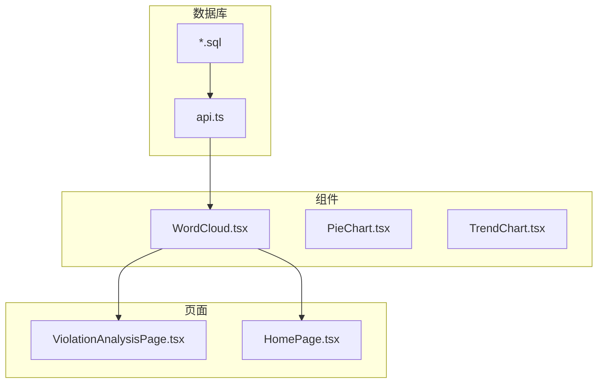
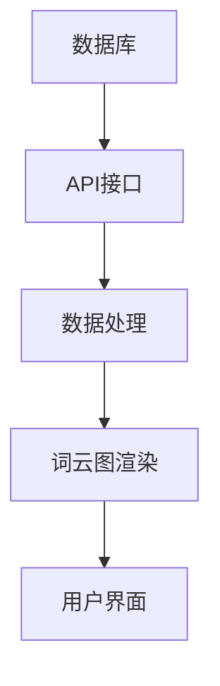
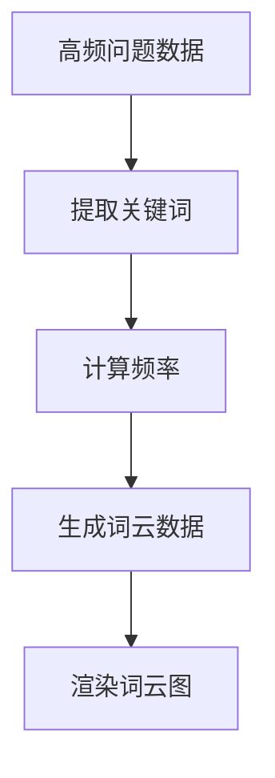
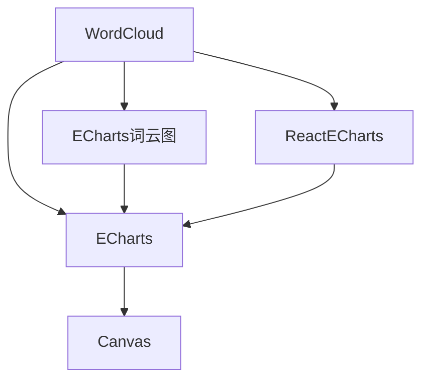

# 词云图分析

<cite>
**本文档引用文件**  
- [WordCloud.tsx](file://src/components/charts/WordCloud.tsx)
- [ViolationAnalysisPage.tsx](file://src/pages/ViolationAnalysisPage.tsx)
- [api.ts](file://src/db/api.ts)
- [colors.ts](file://src/lib/colors.ts)
- [HomePage.tsx](file://src/pages/HomePage.tsx)
- [违规问题词云控制功能迁移说明.md](file://docs/违规问题词云控制功能迁移说明.md)
- [20251219000000_create_violation_analysis_rpc.sql](file://supabase/migrations/20251219000000_create_violation_analysis_rpc.sql)
- [20251220120000_split_home_charts_rpc.sql](file://supabase/migrations/20251220120000_split_home_charts_rpc.sql)
</cite>

## 目录
1. [引言](#引言)
2. [项目结构](#项目结构)
3. [核心组件](#核心组件)
4. [架构概述](#架构概述)
5. [详细组件分析](#详细组件分析)
6. [依赖分析](#依赖分析)
7. [性能考虑](#性能考虑)
8. [故障排除指南](#故障排除指南)
9. [结论](#结论)

## 引言
本文档详细阐述了违规关键词可视化展示的词云图功能，重点分析了WordCloud组件的技术实现、数据处理流程、交互特性及性能优化策略。文档结合ViolationAnalysisPage中的实际使用场景，全面展示了词云图与其他分析组件的集成方式。

## 项目结构
项目结构清晰地组织了词云图相关的组件和功能。核心的词云图组件位于`src/components/charts/`目录下，而相关的数据处理和API调用则分布在`src/db/`目录中。`ViolationAnalysisPage.tsx`和`HomePage.tsx`是词云图的主要使用场景。



**Diagram sources**
- [WordCloud.tsx](file://src/components/charts/WordCloud.tsx)
- [ViolationAnalysisPage.tsx](file://src/pages/ViolationAnalysisPage.tsx)
- [HomePage.tsx](file://src/pages/HomePage.tsx)
- [api.ts](file://src/db/api.ts)

**Section sources**
- [WordCloud.tsx](file://src/components/charts/WordCloud.tsx)
- [ViolationAnalysisPage.tsx](file://src/pages/ViolationAnalysisPage.tsx)
- [HomePage.tsx](file://src/pages/HomePage.tsx)

## 核心组件
词云图功能的核心组件包括WordCloud组件、数据处理逻辑和API接口。WordCloud组件基于ECharts词云图实现，负责渲染和展示违规关键词。数据处理逻辑从高频问题数据中提取关键词，并转换为词云图所需的格式。API接口则负责从数据库中获取高频问题数据。

**Section sources**
- [WordCloud.tsx](file://src/components/charts/WordCloud.tsx)
- [api.ts](file://src/db/api.ts)

## 架构概述
词云图功能的架构分为数据层、逻辑层和展示层。数据层通过API接口从数据库中获取高频问题数据。逻辑层处理数据，提取关键词并计算频率。展示层使用ECharts词云图组件渲染关键词，字体大小映射关键词频率，颜色方案随机分配。



**Diagram sources**
- [api.ts](file://src/db/api.ts)
- [WordCloud.tsx](file://src/components/charts/WordCloud.tsx)

## 详细组件分析

### WordCloud组件分析
WordCloud组件是词云图功能的核心，负责将高频问题数据转换为可视化词云。组件使用ECharts词云图插件，配置了字体大小映射算法和颜色方案。

#### 技术实现
```mermaid
classDiagram
class WordCloud {
+data : {name : string; value : number}[]
+title : string
+tooltipContent? : ReactNode
-chartRef : HTMLDivElement
-useEffect() : void
-initChart() : void
-setOption() : void
}
WordCloud --> ECharts : "使用"
WordCloud --> colors : "使用"
```

**Diagram sources**
- [WordCloud.tsx](file://src/components/charts/WordCloud.tsx)
- [colors.ts](file://src/lib/colors.ts)

#### 配置选项
词云图的配置选项包括：
- **shape**: 词云形状，圆形
- **sizeRange**: 字体大小范围，[12, 40]
- **rotationRange**: 旋转角度范围，[-45, 45]
- **gridSize**: 网格大小，8
- **textStyle**: 文本样式，包括字体、粗细和颜色

**Section sources**
- [WordCloud.tsx](file://src/components/charts/WordCloud.tsx)

### 数据处理流程
词云图的数据处理流程从高频问题数据开始，经过关键词提取和频率计算，最终生成词云图所需的数据格式。

#### 处理流程


**Diagram sources**
- [api.ts](file://src/db/api.ts)
- [WordCloud.tsx](file://src/components/charts/WordCloud.tsx)

#### 关键词提取
关键词提取通过正则表达式和语义分割实现，从违规内容中提取出高频关键词。提取的关键词经过归一化处理，确保数据一致性。

**Section sources**
- [api.ts](file://src/db/api.ts)
- [20251219000000_create_violation_analysis_rpc.sql](file://supabase/migrations/20251219000000_create_violation_analysis_rpc.sql)

### 交互特性
词云图支持鼠标悬停提示和点击事件，增强用户交互体验。

#### 悬停提示
鼠标悬停在关键词上时，显示关键词的详细信息，包括频率和占比。

#### 点击事件
点击关键词可以触发相关操作，如查看相关案例或跳转到详细分析页面。

**Section sources**
- [WordCloud.tsx](file://src/components/charts/WordCloud.tsx)

## 依赖分析
词云图功能依赖于多个外部库和内部组件。主要依赖包括ECharts、ECharts词云图插件和ReactECharts。



**Diagram sources**
- [WordCloud.tsx](file://src/components/charts/WordCloud.tsx)

**Section sources**
- [WordCloud.tsx](file://src/components/charts/WordCloud.tsx)

## 性能考虑
为优化词云图的性能，采取了以下措施：
- **大数据量渲染优化**: 限制显示的关键词数量，避免渲染过多数据。
- **响应式布局调整**: 根据容器宽度动态调整词云图大小和布局。
- **缓存机制**: 缓存高频问题数据，减少重复请求。

**Section sources**
- [WordCloud.tsx](file://src/components/charts/WordCloud.tsx)
- [HomePage.tsx](file://src/pages/HomePage.tsx)

## 故障排除指南
### 词云不显示
- 检查首页配置中词云开关是否打开
- 检查是否有违规关键词数据
- 刷新页面重新加载

### 数据更新问题
- 确认API接口返回数据正常
- 检查数据库中是否有高频问题数据
- 验证关键词提取逻辑是否正确

**Section sources**
- [违规问题词云控制功能迁移说明.md](file://docs/违规问题词云控制功能迁移说明.md)

## 结论
词云图功能通过ECharts词云图组件实现了违规关键词的可视化展示，结合高频问题数据处理流程和交互特性，为用户提供了直观的数据分析体验。通过性能优化和响应式布局，确保了功能的稳定性和可用性。