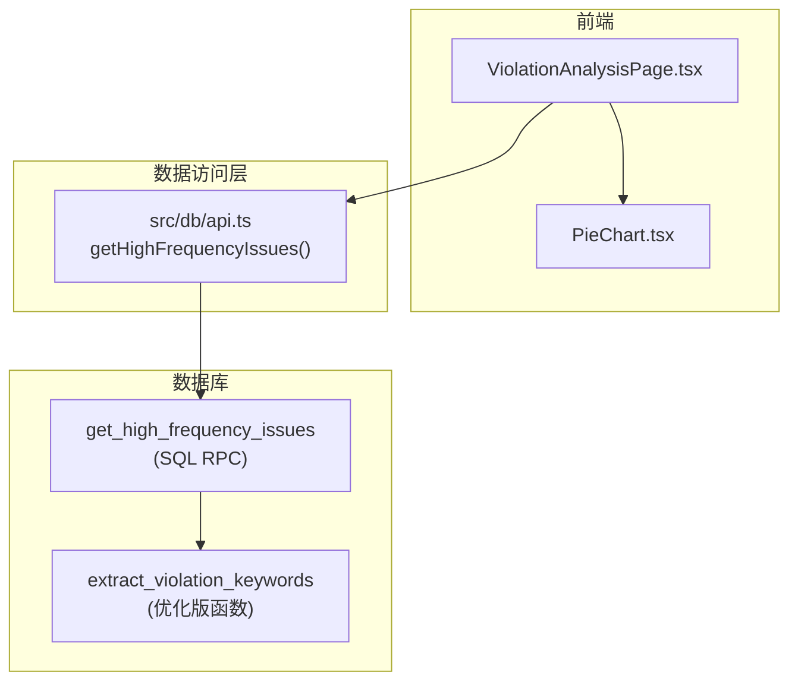
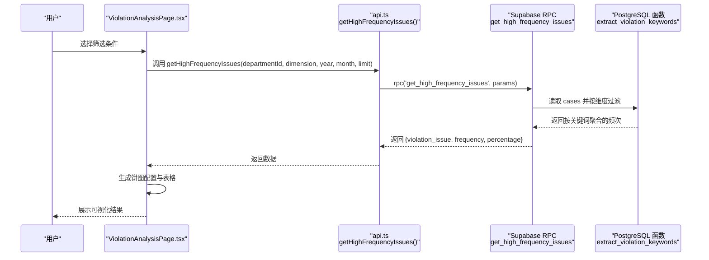
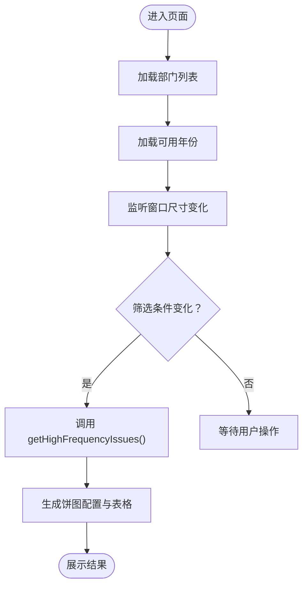
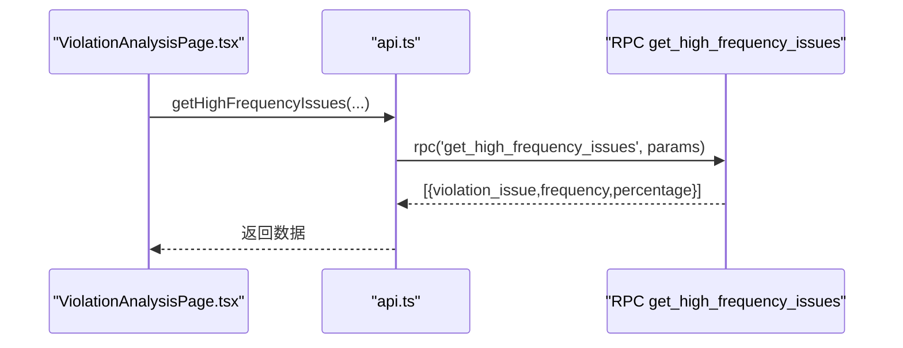
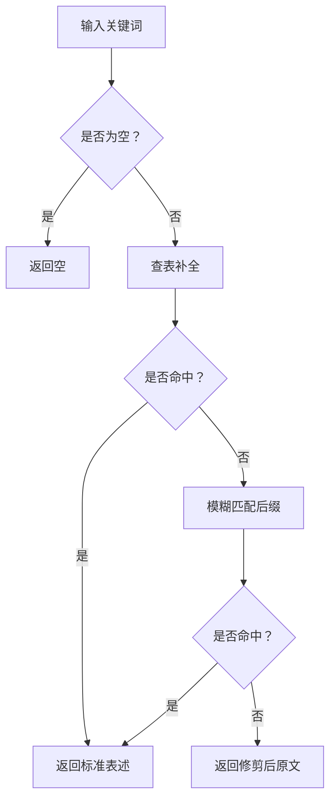
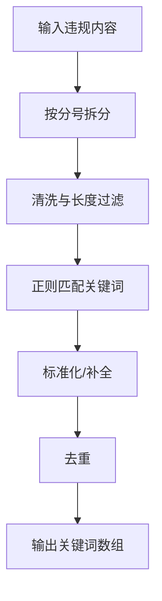
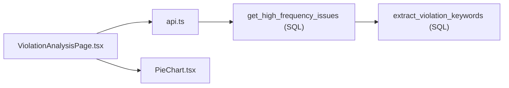

# 违规问题分析功能

<cite>
**本文引用的文件**
- [ViolationAnalysisPage.tsx](file://src/pages/ViolationAnalysisPage.tsx)
- [api.ts](file://src/db/api.ts)
- [compliance_rules.ts](file://src/db/compliance_rules.ts)
- [PieChart.tsx](file://src/components/charts/PieChart.tsx)
- [20251219000000_create_violation_analysis_rpc.sql](file://supabase/migrations/20251219000000_create_violation_analysis_rpc.sql)
- [20251219120000_optimize_violation_extraction.sql](file://supabase/migrations/20251219120000_optimize_violation_extraction.sql)
- [20251219100000_align_high_frequency_issues.sql](file://supabase/migrations/20251219100000_align_high_frequency_issues.sql)
- [test-semantic-split.js](file://test-semantic-split.js)
</cite>

## 目录
1. [简介](#简介)
2. [项目结构](#项目结构)
3. [核心组件](#核心组件)
4. [架构总览](#架构总览)
5. [详细组件分析](#详细组件分析)
6. [依赖分析](#依赖分析)
7. [性能考虑](#性能考虑)
8. [故障排查指南](#故障排查指南)
9. [结论](#结论)

## 简介
本功能围绕“违规问题分析”展开，目标是提供高频违规问题的统计与可视化能力，帮助监管人员快速识别重点问题类别与分布。页面以“筛选条件 + 饼图 + 表格”的组合呈现，支持按全部、按年、按月三种维度统计，并内置合规规则体系用于关键词标准化与完整性校验。

## 项目结构
- 前端页面：ViolationAnalysisPage.tsx 负责筛选、加载数据、渲染图表与表格。
- 数据访问层：src/db/api.ts 封装 Supabase RPC 调用，负责高频问题统计。
- 规则体系：src/db/compliance_rules.ts 定义关键词补全与校验规则。
- 可视化组件：PieChart.tsx 提供通用的响应式饼图封装。
- 数据层：PostgreSQL 函数与 RPC 负责关键词提取、统计与百分比计算。
- 语义拆分：test-semantic-split.js 提供文本按分号拆分的验证脚本。

**图表来源**
- [ViolationAnalysisPage.tsx](file://src/pages/ViolationAnalysisPage.tsx#L1-L405)
- [api.ts](file://src/db/api.ts#L2900-L2933)
- [20251219100000_align_high_frequency_issues.sql](file://supabase/migrations/20251219100000_align_high_frequency_issues.sql#L1-L66)
- [20251219120000_optimize_violation_extraction.sql](file://supabase/migrations/20251219120000_optimize_violation_extraction.sql#L1-L177)

**章节来源**
- [ViolationAnalysisPage.tsx](file://src/pages/ViolationAnalysisPage.tsx#L1-L405)
- [api.ts](file://src/db/api.ts#L2900-L2933)

## 核心组件
- 页面布局与交互
  - 筛选条件：监管部门、数据维度（全部/按年/按月）、年份、月份。
  - 高频问题展示：左侧饼图（问题分布）、右侧表格（排名、频次、占比）。
  - 响应式布局：根据容器宽度动态调整图例与半径等。
- 数据加载与渲染
  - 通过 getHighFrequencyIssues 调用 Supabase RPC 获取 TOP N 的高频问题及占比。
  - 饼图配置由 getPieChartOption 动态生成，支持小屏横向图例与大屏纵向图例。
- 规则体系
  - 关键词补全：COMPLIANCE_MAP 将不完整描述映射为标准法律表述。
  - 关键词校验：REQUIRED_ELEMENTS 确保描述包含行为动词与对象名词，提升可读性与一致性。
- 可视化组件
  - PieChart.tsx 提供通用的响应式饼图，支持图例滚动、百分比标签、主题色板等。

**章节来源**
- [ViolationAnalysisPage.tsx](file://src/pages/ViolationAnalysisPage.tsx#L1-L405)
- [PieChart.tsx](file://src/components/charts/PieChart.tsx#L1-L191)
- [compliance_rules.ts](file://src/db/compliance_rules.ts#L1-L112)

## 架构总览
从用户操作到数据呈现的完整链路如下：
- 用户在 ViolationAnalysisPage.tsx 中选择筛选条件。
- ViolationAnalysisPage.tsx 调用 api.ts 的 getHighFrequencyIssues。
- api.ts 通过 Supabase RPC 调用 get_high_frequency_issues。
- get_high_frequency_issues 在 SQL 中对 cases 表执行过滤与聚合，并计算百分比。
- 前端接收数据后，使用 ECharts 或 PieChart 组件渲染。

**图表来源**
- [ViolationAnalysisPage.tsx](file://src/pages/ViolationAnalysisPage.tsx#L100-L128)
- [api.ts](file://src/db/api.ts#L2900-L2933)
- [20251219100000_align_high_frequency_issues.sql](file://supabase/migrations/20251219100000_align_high_frequency_issues.sql#L1-L66)

## 详细组件分析

### 页面布局与交互（ViolationAnalysisPage.tsx）
- 状态管理
  - 筛选状态：selectedDepartment、dataDimension、selectedYear、selectedMonth。
  - 数据状态：issuesData、loading、containerWidth。
- 生命周期
  - 初始化加载部门列表与可用年份。
  - 监听窗口 resize，动态更新容器宽度以适配响应式。
  - 筛选条件变化时触发数据加载。
- 数据加载
  - 调用 getHighFrequencyIssues，传入部门、维度、年、月、限制数量。
  - 对返回数据进行展示准备（频次、占比）。
- 图表配置
  - getPieChartOption 动态生成 ECharts 配置，支持小屏横向图例、大屏纵向图例、强调态缩放与阴影效果。
  - 使用 chartPalette 保证颜色一致性。
- 表格展示
  - 展示排名、违规问题、频次、占比四列，支持长文本截断与悬浮提示。

**图表来源**
- [ViolationAnalysisPage.tsx](file://src/pages/ViolationAnalysisPage.tsx#L48-L128)

**章节来源**
- [ViolationAnalysisPage.tsx](file://src/pages/ViolationAnalysisPage.tsx#L1-L405)

### 高频问题统计 API（api.ts）
- getHighFrequencyIssues
  - 参数：departmentId、dimension、year、month、limit。
  - 返回：包含 violation_issue、frequency、percentage 的数组。
  - 调用 Supabase RPC get_high_frequency_issues。
- 错误处理：捕获并抛出异常，便于上层统一提示。

**图表来源**
- [api.ts](file://src/db/api.ts#L2900-L2933)

**章节来源**
- [api.ts](file://src/db/api.ts#L2900-L2933)

### 合规规则体系（compliance_rules.ts）
- 关键词补全（normalizeKeyword）
  - 直接映射：基于 COMPLIANCE_MAP 将常见不完整描述标准化。
  - 模糊匹配：对以关键字结尾的短语进行补全，避免过度匹配。
- 关键词校验（validateKeyword）
  - 必须包含至少一个行为动词与一个对象名词，或包含“用户”等关键语义词。
  - 用于提升描述完整性与可读性，辅助前端展示与统计口径统一。

**图表来源**
- [compliance_rules.ts](file://src/db/compliance_rules.ts#L70-L112)

**章节来源**
- [compliance_rules.ts](file://src/db/compliance_rules.ts#L1-L112)

### 饼图组件（PieChart.tsx）
- 特性
  - 响应式布局：根据容器宽度自动切换图例方向与密度。
  - 图例滚动：小屏启用滚动图例，避免拥挤。
  - 百分比标签：可选显示百分比，增强可读性。
  - 主题色板：使用统一的颜色方案，保证跨页面一致性。
- 适用场景
  - ViolationAnalysisPage.tsx 的饼图展示与通用统计图表均可复用。

**章节来源**
- [PieChart.tsx](file://src/components/charts/PieChart.tsx#L1-L191)

### 词云图与高频关键词提取（概念说明）
- 词云图生成思路（概念）
  - 数据来源：高频问题统计结果（violation_issue、frequency）。
  - 文本预处理：对 violation_issue 进行清洗与标准化（可结合合规规则）。
  - 权重计算：frequency 作为词频权重，可进一步归一化至 10-100 的字号区间。
  - 布局与渲染：使用 ECharts 或 D3.js 等可视化库生成词云。
- 注意事项
  - 词云图在本仓库中未直接实现，建议在 ViolationAnalysisPage.tsx 中扩展，或新增独立组件。
  - 若需语义分割，可参考“语义拆分技术”章节的实现思路。

[本节为概念性说明，不直接对应具体源码文件]

### 语义拆分技术在违规内容分析中的应用
- 目标
  - 将多问题合并的违规内容按分号拆分为独立片段，分别进行关键词提取与统计。
- 实现思路
  - 数据库侧：在提取函数中先按中文分号拆分，再对每个片段进行正则匹配与标准化。
  - 前端侧：提供测试脚本验证拆分逻辑，确保统计口径一致。
- 关键点
  - 统一分隔符：将中文分号统一为英文分号，处理换行符。
  - 片段长度与完整性：过滤过短片段，保留完整描述作为兜底。
  - 标准化：对常见不完整描述进行补全，提升统计准确性。

**图表来源**
- [20251219120000_optimize_violation_extraction.sql](file://supabase/migrations/20251219120000_optimize_violation_extraction.sql#L68-L138)
- [test-semantic-split.js](file://test-semantic-split.js#L1-L157)

**章节来源**
- [20251219120000_optimize_violation_extraction.sql](file://supabase/migrations/20251219120000_optimize_violation_extraction.sql#L1-L177)
- [test-semantic-split.js](file://test-semantic-split.js#L1-L157)

## 依赖分析
- 前端依赖
  - ViolationAnalysisPage.tsx 依赖 api.ts 的 getHighFrequencyIssues 与本地 ECharts 配置。
  - PieChart.tsx 作为通用组件被 ViolationAnalysisPage.tsx 复用。
- 数据库依赖
  - get_high_frequency_issues 依赖 extract_violation_keywords，后者在 SQL 中实现语义拆分与关键词提取。
  - 早期版本的 RPC 与函数在迁移中逐步对齐，确保 Canvas 与 SVG 场景统计一致。

**图表来源**
- [ViolationAnalysisPage.tsx](file://src/pages/ViolationAnalysisPage.tsx#L1-L405)
- [api.ts](file://src/db/api.ts#L2900-L2933)
- [20251219100000_align_high_frequency_issues.sql](file://supabase/migrations/20251219100000_align_high_frequency_issues.sql#L1-L66)
- [20251219120000_optimize_violation_extraction.sql](file://supabase/migrations/20251219120000_optimize_violation_extraction.sql#L1-L177)

**章节来源**
- [ViolationAnalysisPage.tsx](file://src/pages/ViolationAnalysisPage.tsx#L1-L405)
- [api.ts](file://src/db/api.ts#L2900-L2933)
- [20251219100000_align_high_frequency_issues.sql](file://supabase/migrations/20251219100000_align_high_frequency_issues.sql#L1-L66)
- [20251219120000_optimize_violation_extraction.sql](file://supabase/migrations/20251219120000_optimize_violation_extraction.sql#L1-L177)

## 性能考虑
- 前端渲染
  - 使用 useMemo 与响应式布局减少不必要的重绘。
  - 饼图配置按容器宽度动态调整，避免小屏拥挤。
- 数据层优化
  - RPC 与 SQL 中直接聚合统计，避免客户端二次处理。
  - 通过维度过滤（全部/按年/按月）缩小扫描范围。
- 关键词提取
  - 数据库侧一次性拆分与匹配，减少前端复杂度。
  - 对匹配结果进行去重，降低重复统计成本。

[本节为通用指导，不直接分析具体文件]

## 故障排查指南
- 无数据或空白图表
  - 检查筛选条件是否正确（部门、年份、月份）。
  - 确认 getHighFrequencyIssues 返回的数据结构是否符合预期。
- 饼图显示异常
  - 检查容器宽度变化监听是否生效。
  - 确认 ECharts 配置项（半径、中心点、图例方向）是否随屏幕变化。
- 关键词不完整或不标准
  - 核对 COMPLIANCE_MAP 与 validateKeyword 的规则是否覆盖常见场景。
  - 在数据库侧确认 extract_violation_keywords 的拆分与匹配逻辑是否生效。
- RPC 调用失败
  - 查看 api.ts 的错误日志与抛出信息，定位 Supabase RPC 调用问题。

**章节来源**
- [ViolationAnalysisPage.tsx](file://src/pages/ViolationAnalysisPage.tsx#L100-L128)
- [api.ts](file://src/db/api.ts#L2900-L2933)
- [compliance_rules.ts](file://src/db/compliance_rules.ts#L1-L112)

## 结论
违规问题分析功能通过“页面筛选 + RPC 统计 + SQL 关键词提取”的架构，实现了高效、一致的高频问题可视化。页面采用响应式设计与通用饼图组件，兼顾可读性与可维护性。合规规则体系为关键词标准化与完整性校验提供了基础保障。未来可在现有基础上扩展词云图与更细粒度的语义拆分，进一步提升分析深度与用户体验。