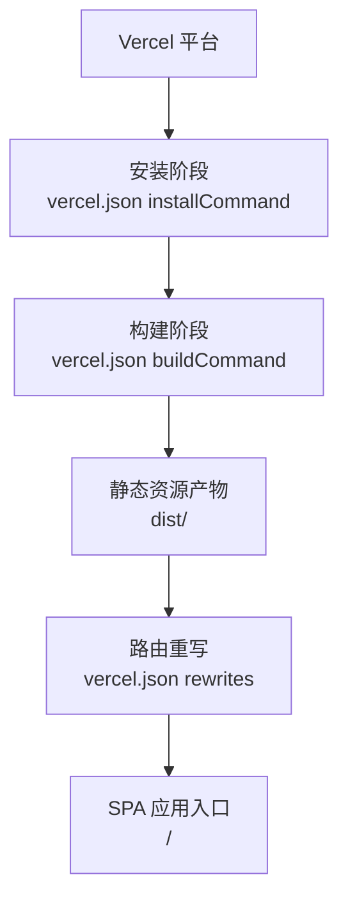
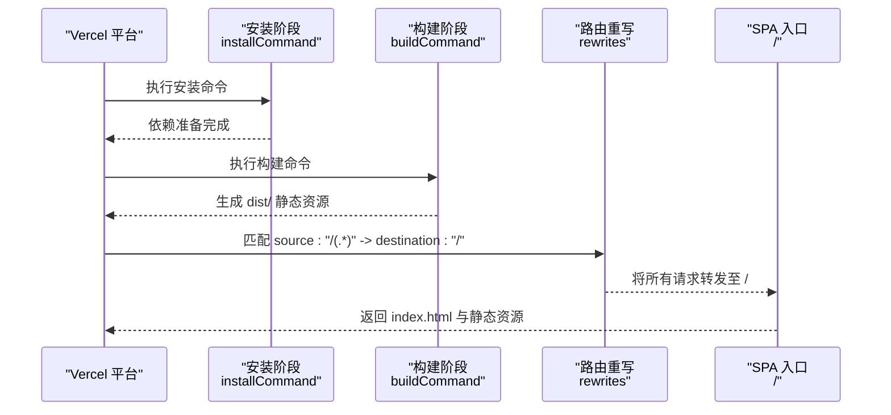
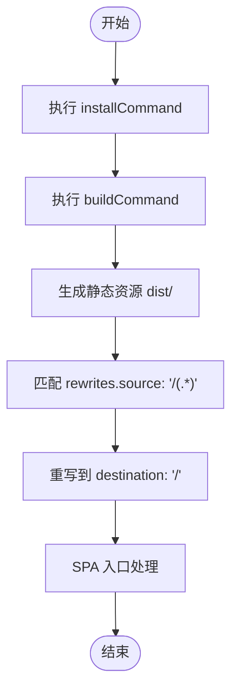
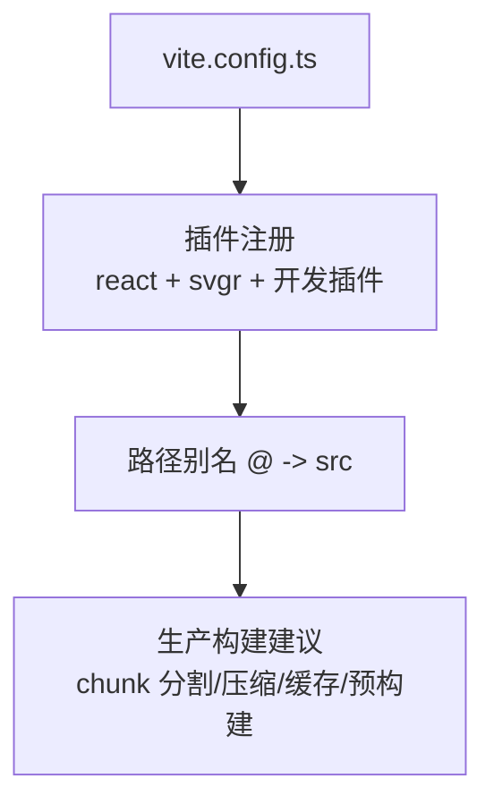
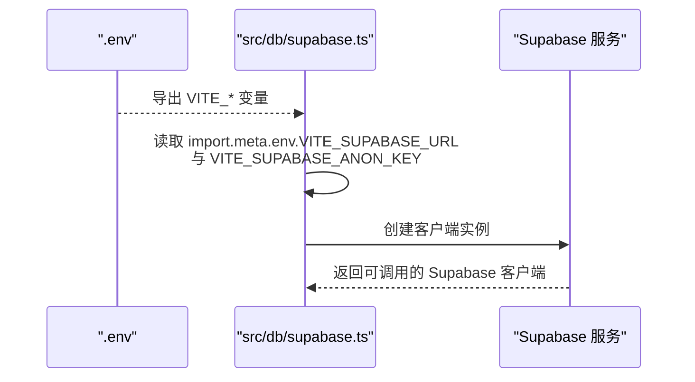
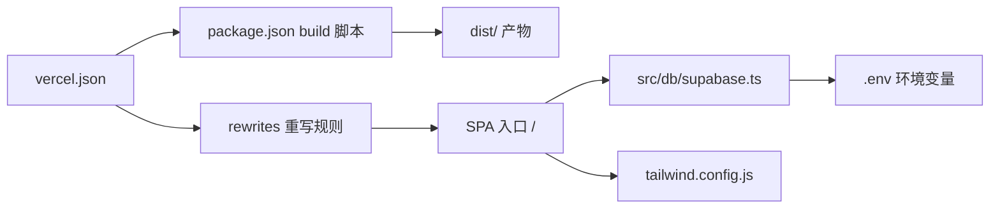

# 部署配置

<cite>
**本文引用的文件**
- [vercel.json](file://vercel.json)
- [.vercelignore](file://.vercelignore)
- [vite.config.ts](file://vite.config.ts)
- [vite.config.dev.ts](file://vite.config.dev.ts)
- [package.json](file://package.json)
- [.env](file://.env)
- [src/db/supabase.ts](file://src/db/supabase.ts)
- [supabase/config.toml](file://supabase/config.toml)
- [src/main.tsx](file://src/main.tsx)
- [tailwind.config.js](file://tailwind.config.js)
</cite>

## 目录
1. [简介](#简介)
2. [项目结构](#项目结构)
3. [核心组件](#核心组件)
4. [架构总览](#架构总览)
5. [详细组件分析](#详细组件分析)
6. [依赖关系分析](#依赖关系分析)
7. [性能考量](#性能考量)
8. [故障排查指南](#故障排查指南)
9. [结论](#结论)
10. [附录](#附录)

## 简介
本文件面向在 Vercel 平台部署本项目的工程团队，系统性说明以下内容：
- vercel.json 中的安装命令、构建命令、环境变量与路由重写规则
- vite.config.ts 的生产构建优化要点（插件、别名、构建产物）
- .vercelignore 的部署排除规则
- 环境变量的安全管理建议（尤其是 Supabase 密钥）
- 部署流水线的自动化配置与回滚机制建议

## 项目结构
本项目采用前端单页应用（SPA）架构，使用 Vite 构建工具，数据访问通过 Supabase 客户端实现。部署于 Vercel 时，通过 vercel.json 控制安装、构建与路由行为；通过 .vercelignore 控制上传排除项；通过 .env 注入运行时环境变量。

图表来源
- [vercel.json](file://vercel.json#L1-L13)

章节来源
- [vercel.json](file://vercel.json#L1-L13)
- [.vercelignore](file://.vercelignore#L1-L7)
- [package.json](file://package.json#L1-L111)

## 核心组件
- Vercel 配置：vercel.json
  - 安装命令：用于在构建前安装依赖（含 legacy peer deps 支持）
  - 构建命令：调用 npm run build 执行 Vite 构建
  - 环境变量：设置 NPM_REGISTRY 以指定包源
  - 路由重写：将所有路径重写到根路径，支持 SPA 前端路由
- 构建配置：vite.config.ts
  - 插件：React、SVGR、自研开发插件
  - 别名：@ 指向 src 目录
- 忽略规则：.vercelignore
  - 排除 node_modules、build、dist、.git 等目录与日志文件
- 环境变量：.env
  - 包含 Supabase URL 与匿名密钥（Vite 前缀）
- Supabase 客户端：src/db/supabase.ts
  - 使用 import.meta.env 读取 VITE_SUPABASE_URL 与 VITE_SUPABASE_ANON_KEY
- Tailwind 配置：tailwind.config.js
  - 内容扫描范围覆盖 src、pages、components、app 等目录

章节来源
- [vercel.json](file://vercel.json#L1-L13)
- [vite.config.ts](file://vite.config.ts#L1-L25)
- [.vercelignore](file://.vercelignore#L1-L7)
- [.env](file://.env#L1-L7)
- [src/db/supabase.ts](file://src/db/supabase.ts#L1-L8)
- [tailwind.config.js](file://tailwind.config.js#L1-L171)

## 架构总览
下图展示从 Vercel 触发安装与构建，到路由重写与 SPA 入口的端到端流程。

图表来源
- [vercel.json](file://vercel.json#L1-L13)

## 详细组件分析

### Vercel 配置（vercel.json）
- 安装命令
  - 使用 npm install --legacy-peer-deps，确保兼容旧版依赖关系
- 构建命令
  - 使用 npm run build，委托 package.json 中的 build 脚本执行 Vite 构建
- 环境变量
  - 设置 NPM_REGISTRY，便于在受限网络环境中指定包源
- 路由重写
  - 将所有路径重写到根路径，使前端路由（如 /cases、/admin）由 SPA 处理

图表来源
- [vercel.json](file://vercel.json#L1-L13)

章节来源
- [vercel.json](file://vercel.json#L1-L13)
- [package.json](file://package.json#L1-L111)

### 构建配置（vite.config.ts）
- 插件体系
  - React 插件：启用 JSX/TSX 支持与热更新
  - SVGR 插件：将 SVG 作为 React 组件引入，支持 icon、exportType、namedExport 等选项
  - 自研开发插件：集成开发工具链能力
- 路径别名
  - @ 指向 src 目录，便于统一导入路径
- 生产优化建议
  - 当前配置未显式声明 rollupOptions 或预构建优化参数；建议在生产构建中补充：
    - chunk 分割策略：按路由或动态导入拆分
    - 压缩与混淆：启用 terser 或 esbuild 压缩
    - 缓存策略：为静态资源设置长缓存与版本化命名
    - 预构建：对第三方依赖进行预构建以提升冷启动性能

图表来源
- [vite.config.ts](file://vite.config.ts#L1-L25)

章节来源
- [vite.config.ts](file://vite.config.ts#L1-L25)

### 开发服务器增强（vite.config.dev.ts）
- 在开发模式下扩展了用户配置，注入调试与 HMR 工具插件
- 提供 HMR 开关与全量刷新接口，便于联调与开发体验优化
- 注意：该配置仅用于本地开发，不参与生产构建

章节来源
- [vite.config.dev.ts](file://vite.config.dev.ts#L1-L117)

### 部署排除规则（.vercelignore）
- 排除 node_modules、build、dist、.git、日志与临时文件等，减少上传体积与构建时间
- 建议保持与 .gitignore 一致的排除策略，避免误传敏感文件

章节来源
- [.vercelignore](file://.vercelignore#L1-L7)

### 环境变量与 Supabase 客户端（.env 与 src/db/supabase.ts）
- .env 中包含：
  - VITE_APP_ID
  - VITE_SUPABASE_URL
  - VITE_SUPABASE_ANON_KEY
- src/db/supabase.ts 通过 import.meta.env 读取上述变量，创建 Supabase 客户端实例
- 生产环境变量需在 Vercel 项目设置中配置，避免硬编码在仓库中

图表来源
- [.env](file://.env#L1-L7)
- [src/db/supabase.ts](file://src/db/supabase.ts#L1-L8)

章节来源
- [.env](file://.env#L1-L7)
- [src/db/supabase.ts](file://src/db/supabase.ts#L1-L8)

### Supabase 认证配置（supabase/config.toml）
- 当前配置中关闭了邮箱确认流程，便于演示与快速上线
- 如需启用邮箱确认，请在对应段落开启 confirmations，并配合后端函数与邮件服务

章节来源
- [supabase/config.toml](file://supabase/config.toml#L1-L3)

### 统计脚本注入（src/main.tsx）
- 在生产环境注入统计脚本，仅在 import.meta.env.PROD 为真时执行
- 有助于在生产环境收集访问数据，但需遵守隐私合规要求

章节来源
- [src/main.tsx](file://src/main.tsx#L1-L27)

### Tailwind 内容扫描（tailwind.config.js）
- content 覆盖 index.html、src、pages、components、app 等目录，确保按需生成样式
- 建议在生产构建中配合 PurgeCSS 或 PostCSS 清理未使用样式，减小产物体积

章节来源
- [tailwind.config.js](file://tailwind.config.js#L1-L171)

## 依赖关系分析
- Vercel 侧
  - vercel.json 依赖 package.json 的 build 脚本
  - 路由重写依赖前端路由设计（SPA）
- 前端侧
  - vite.config.ts 为构建基础配置
  - src/db/supabase.ts 依赖 import.meta.env（由 .env 注入）
  - Tailwind 配置影响样式产物大小与构建时间

图表来源
- [vercel.json](file://vercel.json#L1-L13)
- [package.json](file://package.json#L1-L111)
- [src/db/supabase.ts](file://src/db/supabase.ts#L1-L8)
- [tailwind.config.js](file://tailwind.config.js#L1-L171)

章节来源
- [vercel.json](file://vercel.json#L1-L13)
- [package.json](file://package.json#L1-L111)
- [src/db/supabase.ts](file://src/db/supabase.ts#L1-L8)
- [tailwind.config.js](file://tailwind.config.js#L1-L171)

## 性能考量
- 代码分割
  - 建议基于路由或动态导入进行分包，减少首屏体积
- 压缩与混淆
  - 生产构建启用压缩（terser/esbuild），并开启最小化
- 缓存策略
  - 对静态资源设置长缓存与版本化命名；对 HTML 设置短缓存
- 预构建
  - 对第三方依赖进行预构建，缩短冷启动时间
- 样式优化
  - 结合 PurgeCSS 清理未使用样式，降低 CSS 体积

## 故障排查指南
- 构建失败
  - 检查 vercel.json 的 installCommand 与 buildCommand 是否与 package.json 脚本一致
  - 确认 .vercelignore 未误排除必要文件
- 路由 404
  - 确认 rewrites.source 与 destination 配置正确，且前端路由与后端路由一致
- Supabase 无法连接
  - 在 Vercel 项目设置中添加 VITE_SUPABASE_URL 与 VITE_SUPABASE_ANON_KEY
  - 确认 .env 中的变量名前缀为 VITE_，并在生产环境生效
- 样式异常
  - 检查 tailwind.config.js 的 content 范围是否覆盖到新增组件
- 统计脚本未生效
  - 确认 import.meta.env.PROD 为真，且未被 CSP 屏蔽

章节来源
- [vercel.json](file://vercel.json#L1-L13)
- [.vercelignore](file://.vercelignore#L1-L7)
- [.env](file://.env#L1-L7)
- [src/db/supabase.ts](file://src/db/supabase.ts#L1-L8)
- [tailwind.config.js](file://tailwind.config.js#L1-L171)
- [src/main.tsx](file://src/main.tsx#L1-L27)

## 结论
本项目在 Vercel 上的部署流程清晰：通过 vercel.json 指定安装与构建命令，利用 rewrites 实现 SPA 路由；通过 .vercelignore 控制上传排除；通过 .env 注入运行时变量并由 Supabase 客户端使用。建议在生产构建中补充代码分割、压缩与缓存策略，并在 Vercel 项目设置中安全地配置环境变量，确保部署稳定与安全。

## 附录

### Vercel 部署流水线与回滚建议
- 自动化配置
  - 在 Vercel 项目设置中绑定 Git 仓库，开启“自动部署”与“生产分支保护”
  - 使用 vercel.json 的 rewrites 保证 SPA 路由正常
- 回滚机制
  - Vercel 默认保留最近若干个版本，可在控制台选择历史版本进行回滚
  - 建议每次发布打上语义化版本标签，便于精准回滚

[本节为通用实践建议，无需特定文件引用]