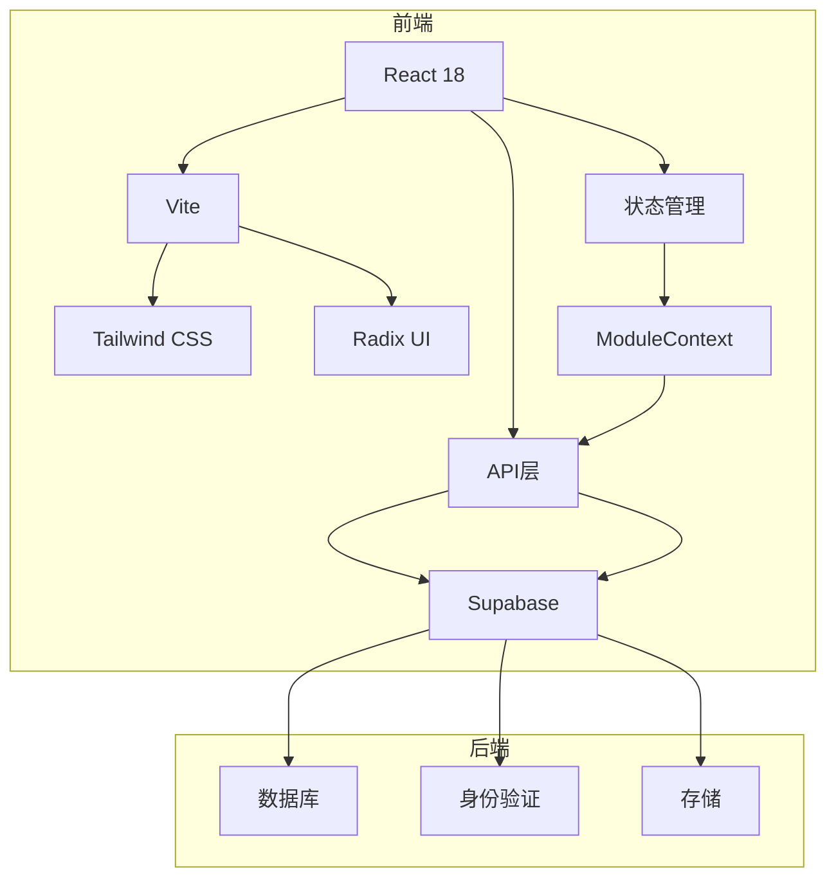

# 项目概述

<cite>
**本文档引用的文件**
- [App.tsx](file://src/App.tsx)
- [main.tsx](file://src/main.tsx)
- [routes.tsx](file://src/routes.tsx)
- [supabase.ts](file://src/db/supabase.ts)
- [ModuleContext.tsx](file://src/contexts/ModuleContext.tsx)
- [HomePage.tsx](file://src/pages/HomePage.tsx)
- [CasesPage.tsx](file://src/pages/CasesPage.tsx)
- [TrendAnalysisPage.tsx](file://src/pages/TrendAnalysisPage.tsx)
- [api.ts](file://src/db/api.ts)
- [ProtectedModuleRoute.tsx](file://src/components/common/ProtectedModuleRoute.tsx)
- [types.ts](file://src/types/types.ts)
- [TrendOverviewChart.tsx](file://src/components/charts/TrendOverviewChart.tsx)
- [tailwind.config.js](file://tailwind.config.js)
- [vite.config.ts](file://vite.config.ts)
- [package.json](file://package.json)
</cite>

## 目录
1. [项目定位与核心功能](#项目定位与核心功能)
2. [技术架构与设计理念](#技术架构与设计理念)
3. [系统主要使用场景](#系统主要使用场景)
4. [项目整体架构图](#项目整体架构图)
5. [初学者入门指南](#初学者入门指南)

## 项目定位与核心功能

合规通平台是一个面向企业合规管理的综合性解决方案，旨在帮助用户高效处理和分析监管通报数据。该平台通过集成案例查询、趋势分析、违规问题统计、模块化配置和权限控制等核心功能，为用户提供全面的数据洞察和管理能力。

平台的核心功能包括：
- **案例查询**：用户可以通过关键词、日期范围、监管部门和应用平台等多维度条件，对历史通报案例进行精确检索和筛选。
- **趋势分析**：提供多维度的趋势分析功能，包括按月度、半年度、年度等时间维度的通报排名，以及针对特定监管部门的应用趋势分析。
- **违规问题统计**：通过图表形式展示违规问题的分布情况，帮助用户快速识别高频违规问题。
- **模块化配置**：支持对首页模块、导航栏、页脚等内容的灵活配置，满足不同用户的个性化需求。
- **权限控制**：基于用户角色（普通用户和管理员）实现细粒度的权限控制，确保数据安全和操作合规。

**Section sources**
- [routes.tsx](file://src/routes.tsx#L33-L204)
- [HomePage.tsx](file://src/pages/HomePage.tsx#L1-L761)
- [CasesPage.tsx](file://src/pages/CasesPage.tsx#L1-L537)
- [TrendAnalysisPage.tsx](file://src/pages/TrendAnalysisPage.tsx#L1-L678)

## 技术架构与设计理念

合规通平台采用现代化的前后端分离架构，前端基于React 18、Vite、Tailwind CSS和Radix UI构建，后端服务由Supabase提供支持。这种架构设计不仅提升了开发效率，还保证了系统的高性能和可扩展性。

### 前端技术栈
- **React 18**：作为核心框架，利用其组件化和虚拟DOM特性，实现高效的UI渲染和状态管理。
- **Vite**：作为构建工具，提供快速的开发服务器启动和热更新功能，显著提升开发体验。
- **Tailwind CSS**：采用实用优先的CSS框架，结合自定义配置，实现一致且美观的UI设计。
- **Radix UI**：使用无样式、可访问的UI组件库，确保组件的灵活性和可定制性。

### 后端服务
- **Supabase**：作为后端即服务（BaaS）平台，提供数据库、身份验证、存储等功能，简化后端开发和维护工作。

### 设计理念
- **前后端分离**：前端负责UI展示和用户交互，后端专注于数据处理和业务逻辑，两者通过API进行通信，实现解耦和独立部署。
- **模块化设计**：将功能划分为独立的模块，便于维护和扩展，同时支持按需加载，优化性能。
- **响应式布局**：适配不同设备和屏幕尺寸，确保在桌面和移动设备上均能提供良好的用户体验。

**Section sources**
- [vite.config.ts](file://vite.config.ts#L1-L25)
- [tailwind.config.js](file://tailwind.config.js#L1-L171)
- [package.json](file://package.json#L1-L111)
- [supabase.ts](file://src/db/supabase.ts#L1-L8)

## 系统主要使用场景

合规通平台适用于多种使用场景，主要包括：

### 企业合规管理
企业可以利用该平台监控和分析自身产品的合规状况，及时发现和解决潜在的违规问题，降低法律风险。

### 法律事务处理
律师事务所和法律顾问可以使用该平台进行案例研究和法律分析，为客户提供专业的合规建议和服务。

### 监管机构工作
监管机构可以利用该平台进行数据汇总和趋势分析，辅助决策制定和政策调整，提高监管效率。

### 风险控制分析
金融机构和投资公司可以使用该平台评估投资标的的合规风险，为投资决策提供数据支持。

这些使用场景共同构成了合规通平台的价值主张，使其成为企业和组织不可或缺的合规管理工具。

**Section sources**
- [routes.tsx](file://src/routes.tsx#L33-L204)
- [HomePage.tsx](file://src/pages/HomePage.tsx#L1-L761)

## 项目整体架构图

**Diagram sources**
- [App.tsx](file://src/App.tsx#L1-L33)
- [main.tsx](file://src/main.tsx#L1-L27)
- [routes.tsx](file://src/routes.tsx#L1-L207)
- [supabase.ts](file://src/db/supabase.ts#L1-L8)
- [ModuleContext.tsx](file://src/contexts/ModuleContext.tsx#L1-L62)

## 初学者入门指南

为了帮助开发者快速上手合规通平台，以下是必要的前置知识和代码库结构介绍。

### 前置知识
- **React**：熟悉React的基本概念和语法，包括组件、状态、生命周期等。
- **TypeScript**：了解TypeScript的类型系统和接口定义，能够编写类型安全的代码。
- **Vite**：掌握Vite的基本配置和使用方法，理解其在开发和生产环境中的作用。
- **Tailwind CSS**：熟悉Tailwind CSS的实用类和配置方式，能够快速构建响应式布局。
- **Supabase**：了解Supabase的基本功能和API，能够进行数据查询和操作。

### 代码库结构
- **src/components**：存放可复用的UI组件，如图表、表单、按钮等。
- **src/pages**：存放页面级别的组件，每个页面对应一个独立的文件。
- **src/db**：包含与数据库交互的API函数和配置。
- **src/contexts**：定义全局状态管理上下文，如模块状态。
- **src/types**：定义项目中使用的类型和接口。
- **src/utils**：存放通用的工具函数，如日期处理、字符串操作等。

通过以上指南，开发者可以快速了解合规通平台的技术栈和代码结构，为后续的开发和维护工作打下坚实的基础。

**Section sources**
- [vite.config.ts](file://vite.config.ts#L1-L25)
- [tailwind.config.js](file://tailwind.config.js#L1-L171)
- [types.ts](file://src/types/types.ts#L1-L184)
- [package.json](file://package.json#L1-L111)