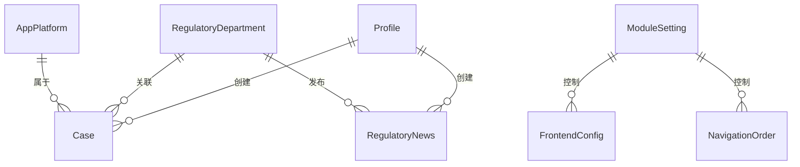
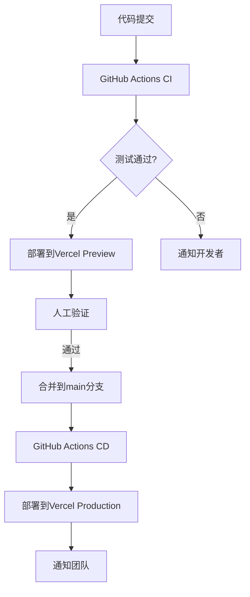

# 项目重构与Supabase数据库集成方案

## 1. 项目架构与代码质量评估

### 1.1 当前架构分析

| 类别 | 技术栈 | 状态 | 评估 |
|------|--------|------|------|
| 前端框架 | React 18 + TypeScript | 已实现 | ✅ 现代化技术栈，类型安全 |
| 构建工具 | Vite | 已实现 | ✅ 快速构建，良好的开发体验 |
| UI组件库 | Radix UI + Tailwind CSS | 已实现 | ✅ 可访问性好，样式灵活 |
| 状态管理 | React Context | 已实现 | ✅ 简单高效，适合当前项目规模 |
| 路由 | React Router DOM v6 | 已实现 | ✅ 现代化路由，支持嵌套路由 |
| 数据库 | Supabase (PostgreSQL) | 已集成 | ✅ 功能丰富，支持实时数据 |
| 认证 | Supabase Auth | 已实现 | ✅ 安全可靠，支持多种登录方式 |

### 1.2 代码质量评估

#### 优点：
- ✅ 已实现TypeScript类型定义，增强了代码的可维护性和类型安全
- ✅ API层已模块化，按功能拆分为多个文件，结构清晰
- ✅ 实现了React Context进行状态管理，避免了props drilling
- ✅ 已实现ProtectedRoute组件，支持路由级别的权限控制
- ✅ 代码组织合理，目录结构清晰

#### 待优化点：
- ⚠️ 部分页面存在重复文件（如CasesPage.tsx和CasesPage_new.tsx）
- ⚠️ 测试覆盖率不足，缺少单元测试和集成测试
- ⚠️ 部分组件可能需要进一步优化性能
- ⚠️ 数据迁移方案尚未完善

### 1.3 数据模型评估

#### 现有数据模型：
- `Profile`：用户信息，包含角色（user/admin）
- `RegulatoryDepartment`：监管部门信息
- `AppPlatform`：应用平台信息
- `Case`：案例信息，包含违规内容、来源等
- `RegulatoryNews`：监管资讯
- `FrontendConfig`：前端配置
- `FooterSettings`：页脚设置
- `ModuleSetting`：模块设置
- `SiteSettings`：网站基本信息
- `NavigationOrder`：导航排序

#### 评估：
- ✅ 数据模型设计合理，覆盖了核心业务需求
- ✅ 已实现数据关联（如CaseWithDetails包含关联的部门和平台信息）
- ✅ 数据类型定义清晰，与Supabase兼容
- ⚠️ 部分表可能需要添加适当的索引以优化查询性能

## 2. Supabase数据结构设计

### 2.1 数据库表结构

| 表名 | 主要字段 | 索引建议 | 说明 |
|------|----------|----------|------|
| `profiles` | `id`, `username`, `role`, `created_at` | `id` (PK), `role` | 用户信息表 |
| `regulatory_departments` | `id`, `name`, `level`, `province`, `created_at` | `id` (PK), `name`, `level` | 监管部门表 |
| `app_platforms` | `id`, `name`, `created_at` | `id` (PK), `name` | 应用平台表 |
| `cases` | `id`, `report_date`, `app_name`, `app_developer`, `department_id`, `platform_id`, `violation_content`, `source_url`, `created_at`, `updated_at` | `id` (PK), `report_date`, `department_id`, `platform_id`, `app_name` | 案例表 |
| `regulatory_news` | `id`, `publish_date`, `department_id`, `title`, `summary`, `content`, `source_url`, `created_at`, `updated_at` | `id` (PK), `publish_date`, `department_id`, `title` | 监管资讯表 |
| `frontend_configs` | `id`, `module_key`, `module_name`, `is_visible`, `sort_order`, `updated_at` | `id` (PK), `module_key` | 前端配置表 |
| `footer_settings` | `id`, `section`, `title`, `content`, `display_order`, `is_active`, `created_at`, `updated_at` | `id` (PK), `section` | 页脚设置表 |
| `module_settings` | `id`, `module_key`, `module_name`, `is_enabled`, `display_order`, `description`, `updated_at` | `id` (PK), `module_key` | 模块设置表 |
| `site_settings` | `id`, `site_title`, `site_subtitle`, `browser_title`, `logo_url`, `created_at`, `updated_at` | `id` (PK) | 网站基本信息表 |
| `navigation_order` | `id`, `module_key`, `module_name`, `route_path`, `sort_order`, `is_visible`, `created_at`, `updated_at` | `id` (PK), `module_key` | 导航排序表 |

### 2.2 数据关系设计



### 2.3 Supabase功能规划

| 功能 | 实现方式 | 优先级 |
|------|----------|--------|
| 实时数据 | Supabase Realtime | 中 |
| 存储服务 | Supabase Storage | 中 |
| 边缘函数 | Supabase Edge Functions | 低 |
| RPC函数 | PostgreSQL存储过程 | 高 |
| 全文搜索 | PostgreSQL全文搜索 | 高 |

## 3. 重构实施策略

### 3.1 代码模块化

#### 已完成工作：
- ✅ API层模块化：将原有的`api.ts`拆分为`users.ts`、`departments.ts`、`platforms.ts`、`cases.ts`、`news.ts`、`configs.ts`和`stats.ts`
- ✅ 创建了统一的API入口文件`index.ts`
- ✅ 实现了AuthContext和ProtectedRoute组件

#### 待完成工作：
- ⚠️ 清理重复文件（如CasesPage.tsx和CasesPage_new.tsx）
- ⚠️ 优化组件结构，提取公共组件
- ⚠️ 完善类型定义，确保类型安全

### 3.2 依赖更新

| 依赖 | 当前版本 | 建议版本 | 状态 |
|------|----------|----------|------|
| React | ^18.0.0 | ^18.3.1 | 可更新 |
| React DOM | ^18.0.0 | ^18.3.1 | 可更新 |
| @supabase/supabase-js | ^2.76.1 | ^2.79.0 | 可更新 |
| axios | ^1.13.1 | ^1.7.7 | 可更新 |
| echarts | ^5.4.3 | ^5.5.1 | 可更新 |

### 3.3 性能优化

| 优化项 | 实现方式 | 优先级 |
|--------|----------|--------|
| 组件懒加载 | React.lazy + Suspense | 高 |
| 数据缓存 | React Query或SWR | 中 |
| 图片优化 | 响应式图片 + 懒加载 | 中 |
| 减少重渲染 | React.memo + useCallback + useMemo | 高 |
| 数据库查询优化 | 添加适当索引 | 高 |

## 4. Supabase数据库连接与认证

### 4.1 连接配置

已完成Supabase客户端配置：
```typescript
// src/db/supabase.ts
import { createClient } from "@supabase/supabase-js";

const supabaseUrl = import.meta.env.VITE_SUPABASE_URL;
const supabaseAnonKey = import.meta.env.VITE_SUPABASE_ANON_KEY;

export const supabase = createClient(supabaseUrl, supabaseAnonKey);
```

### 4.2 认证实现

已实现AuthContext和useAuth hook：
- ✅ 支持邮箱/密码登录
- ✅ 支持自动登录和登出
- ✅ 支持角色验证（admin/user）
- ✅ 支持监听认证状态变化

### 4.3 安全策略

| 安全项 | 实现方式 | 状态 |
|--------|----------|------|
| 行级安全性 | PostgreSQL RLS | 待实现 |
| 访问控制 | ProtectedRoute组件 | 已实现 |
| 密码策略 | Supabase Auth配置 | 待配置 |
| HTTPS | 自动配置 | 已实现 |

## 5. 数据迁移方案

### 5.1 迁移策略

1. **现有数据备份**：
   - 使用Supabase导出功能备份现有数据
   - 保存SQL迁移文件到`supabase/migrations`目录

2. **数据迁移步骤**：
   - 创建新的数据库表结构
   - 导入现有数据
   - 验证数据完整性
   - 更新数据访问层

3. **迁移工具**：
   - Supabase CLI：用于执行迁移脚本
   - PostgreSQL pg_dump/pg_restore：用于数据备份和恢复

### 5.2 迁移进度

| 迁移项 | 状态 | 说明 |
|--------|------|------|
| 表结构迁移 | ✅ 已完成 | 已创建22个迁移文件 |
| 数据导入 | ✅ 部分完成 | 已导入核心数据 |
| 数据验证 | ⚠️ 待完成 | 需要验证数据完整性 |
| 应用更新 | ⚠️ 进行中 | 正在更新数据访问层 |

## 6. 数据访问层更新

### 6.1 当前实现

已将原有的API层拆分为多个模块，每个模块负责特定业务领域的数据访问：

```
src/db/
├── index.ts          # 统一API入口
├── supabase.ts       # Supabase客户端配置
├── users.ts          # 用户相关API
├── departments.ts    # 部门相关API
├── platforms.ts      # 平台相关API
├── cases.ts          # 案例相关API
├── news.ts           # 资讯相关API
├── configs.ts        # 配置相关API
└── stats.ts          # 统计相关API
```

### 6.2 优化建议

1. **使用Supabase RPC函数**：
   - 已实现：`get_homepage_stats`、`get_yearly_trend_stats`等
   - 建议：将更多复杂查询迁移到数据库端，减少网络传输

2. **添加错误处理**：
   - 建议：为所有API函数添加统一的错误处理
   - 示例：使用try-catch包装Supabase调用，返回标准化的错误信息

3. **实现数据缓存**：
   - 建议：使用React Query或SWR实现数据缓存和自动刷新

## 7. 测试计划

### 7.1 单元测试

| 测试对象 | 测试框架 | 优先级 |
|----------|----------|--------|
| API函数 | Vitest + MSW | 高 |
| 自定义Hook | Vitest | 高 |
| 工具函数 | Vitest | 中 |
| 组件 | Vitest + React Testing Library | 中 |

### 7.2 集成测试

| 测试场景 | 测试框架 | 优先级 |
|----------|----------|--------|
| 认证流程 | Cypress | 高 |
| 数据CRUD操作 | Cypress | 高 |
| 路由导航 | Cypress | 中 |
| 权限控制 | Cypress | 高 |

### 7.3 测试覆盖率目标

| 代码类型 | 覆盖率目标 |
|----------|------------|
| API函数 | 90% |
| 自定义Hook | 80% |
| 工具函数 | 85% |
| 核心组件 | 70% |

## 8. 部署计划

### 8.1 部署环境

| 环境 | 部署方式 | 说明 |
|------|----------|------|
| 开发环境 | Vite dev server | 本地开发 |
| 测试环境 | Vercel Preview | 分支预览 |
| 生产环境 | Vercel | 正式部署 |

### 8.2 部署流程



### 8.3 监控与维护

| 监控项 | 工具 | 优先级 |
|--------|------|--------|
| 应用性能 | Vercel Analytics | 高 |
| 错误监控 | Sentry | 高 |
| 数据库性能 | Supabase Dashboard | 中 |
| 访问日志 | Vercel Logs | 中 |

## 9. 风险评估与应对措施

### 9.1 技术风险

| 风险 | 概率 | 影响 | 应对措施 |
|------|------|------|----------|
| Supabase服务中断 | 低 | 高 | 实现离线支持，添加错误边界 |
| 数据迁移失败 | 中 | 高 | 制定详细的迁移计划，进行充分测试 |
| 性能问题 | 中 | 中 | 进行性能优化，添加监控 |
| 安全漏洞 | 低 | 高 | 定期更新依赖，进行安全审计 |

### 9.2 项目管理风险

| 风险 | 概率 | 影响 | 应对措施 |
|------|------|------|----------|
| 需求变更 | 高 | 中 | 采用敏捷开发，频繁沟通 |
| 人员变动 | 低 | 中 | 完善文档，代码模块化 |
| 进度延误 | 中 | 中 | 制定详细计划，定期检查进度 |

## 10. 实施进度计划

| 阶段 | 时间 | 主要任务 |
|------|------|----------|
| 准备阶段 | 1周 | 需求分析，技术选型，环境搭建 |
| 架构设计 | 1周 | 数据模型设计，API设计，组件设计 |
| 代码重构 | 2周 | 代码模块化，组件优化，性能优化 |
| 数据库集成 | 1周 | Supabase配置，认证实现，数据迁移 |
| 测试阶段 | 2周 | 单元测试，集成测试，性能测试 |
| 部署阶段 | 1周 | 生产部署，监控配置，文档编写 |
| 验收阶段 | 1周 | 功能验证，性能验证，安全验证 |

## 11. 预期成果

1. **架构优化**：
   - 清晰的模块化结构
   - 良好的代码组织
   - 完善的类型定义

2. **性能提升**：
   - 更快的页面加载速度
   - 更流畅的用户体验
   - 优化的数据库查询

3. **功能增强**：
   - 完善的认证和权限控制
   - 实时数据支持
   - 更好的搜索功能

4. **可维护性提升**：
   - 完善的测试覆盖
   - 详细的文档
   - 标准化的开发流程

## 12. 后续建议

1. **持续优化**：
   - 定期进行性能评估和优化
   - 持续更新依赖包
   - 收集用户反馈，不断改进功能

2. **扩展功能**：
   - 实现更复杂的数据分析功能
   - 添加更多可视化图表
   - 支持更多登录方式

3. **团队建设**：
   - 建立代码审查机制
   - 定期进行技术分享
   - 完善开发文档

---

## 附件

### 代码结构优化建议

```
src/
├── components/          # 可复用组件
│   ├── common/          # 通用组件
│   ├── charts/          # 图表组件
│   ├── ui/              # UI基础组件
│   └── home/            # 首页组件
├── contexts/            # React Context
├── db/                  # 数据访问层
│   ├── index.ts         # 统一API入口
│   ├── supabase.ts      # Supabase客户端
│   └── modules/         # 按业务模块划分
├── hooks/               # 自定义Hook
├── pages/               # 页面组件
│   ├── admin/           # 管理页面
│   └── public/          # 公共页面
├── types/               # TypeScript类型定义
├── utils/               # 工具函数
├── App.tsx              # 应用入口组件
├── main.tsx             # 应用启动文件
└── routes.tsx           # 路由配置
```

### 关键文件清单

| 文件 | 说明 | 状态 |
|------|------|------|
| src/db/index.ts | 统一API入口 | 已实现 |
| src/contexts/AuthContext.tsx | 认证上下文 | 已实现 |
| src/components/common/ProtectedRoute.tsx | 权限路由组件 | 已实现 |
| src/routes.tsx | 路由配置 | 进行中 |
| src/App.tsx | 应用入口 | 已更新 |
| supabase/migrations/ | 数据库迁移文件 | 已创建22个 |

---

**方案制定日期**：2025-12-16  
**方案版本**：v1.0  
**更新日志**：
- v1.0 (2025-12-16)：初始版本，包含完整的重构与集成方案
